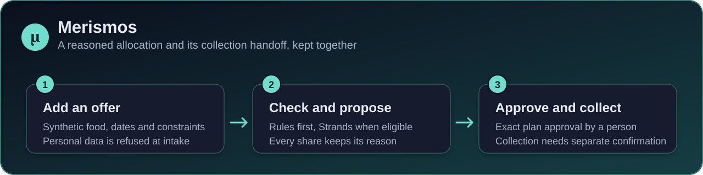
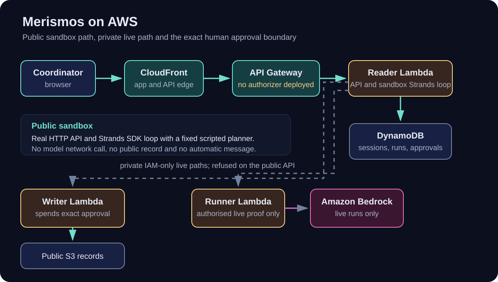

# Merismos



[](https://github.com/upgradedev/merismos-aws/actions/workflows/ci.yml)
[](https://github.com/upgradedev/merismos-aws/actions/workflows/frontend-ci.yml)
[](https://github.com/upgradedev/merismos-aws/actions/workflows/docs.yml)
[](LICENSE)


[](docs/architecture.md)

Maria, a fictional volunteer food coordinator, uses Merismos rules and Strands agents to check each share before approving an exact allocation.

**[Open the live coordinator workspace](https://d2qnkmlhs7y5fp.cloudfront.net/)** · [Judge walkthrough](#try-one-short-flow) · [Architecture](#architecture) · [Evidence](docs/evidence.md)

Built for **AWS Agents for Humans**, Good Neighbor Agents. Built with the **Strands Agents SDK**, React, Python,
AWS Lambda, Amazon API Gateway, Amazon Bedrock, Amazon DynamoDB, Amazon S3, Amazon CloudFront, Amazon EventBridge
Scheduler, Amazon SQS, AWS IAM, AWS Secrets Manager, Amazon CloudWatch and Terraform.

> **Synthetic sandbox.** No account or installation. It runs a real Strands loop with a fixed scripted planner and no model network call. Nothing is published or sent. Choose **+ Add offer → Try success** to edit an invented donation.

## Try one short flow

No typing is needed, and the sandbox publishes nothing.

1. On the **Dashboard** choose **Start with this offer →** (**Continue my work →** on a return visit).
2. Choose **Work out the split**, review who receives a share and why, tick the consent box and choose **Approve in sandbox**.
3. Choose **Open collection tasks →** and **Claim this share**, tick the confirmation box and choose **Confirm collection**.

To try an invented donation, choose **+ Add offer → Try success**, edit the fields, choose **Add to sandbox**, then
**Work out the split**. A recorded allocation is not a collected donation. Also in the sandbox:

- **Try refusal** fills in a broken cold chain; after **Add to sandbox** and **Work out the split** it is refused in full and never offered for approval.
- **Try correction** fills in a phone-shaped note: intake refuses it on **Add to sandbox**, keeps the fields and accepts a corrected note.
- In **Evidence bundle and recovery**, **Copy evidence bundle** copies the decision, logical source references from
  the current API snapshot, run, revision, provider, mode, history and limits.
- **Import a donor CSV instead** (under **+ Add offer**) files only the rows you select. **Rehearse a collection disruption** proposes a new plan after one recipient's capacity drops. **Pickup manifest · copy or download** gives a plain-text handoff that sends no message.
- **About this demo**, in the page footer, shows the provider, the snapshot time and the automated test reports.

## Contents

- [Try one short flow](#try-one-short-flow)
- [What is real and what is demonstrated](#what-is-real-and-what-is-demonstrated)
- [How Strands Agents are used](#how-strands-agents-are-used)
- [Architecture](#architecture)
- [Cost and sustainability](#cost-and-sustainability)
- [Run it locally](#run-it-locally)
- [Documentation](#documentation)
- [Validation and release](#validation-and-release)
- [Pre-existing components and licences](#pre-existing-components-and-licences)

## What is real and what is demonstrated

The five community organisations are synthetic, and the donors, donations and example collection confirmations
are invented; none of it is evidence of food rescued. Merismos is a browser workspace: a coordinator can copy its
summary into an existing channel, and there is no automatic chat delivery, email, telephony or payment.

| Capability | Public status |
| --- | --- |
| Editable offers, refusal, correction, allocation and collection confirmation | Live in an isolated synthetic sandbox |
| Strands Agents SDK loop and tool guard | Live, using `scripted-planner/1.0.0` with no model network call |
| Amazon Bedrock run | Private proof path only; public requests cannot start one |
| Exact human approval | Live in the sandbox; records the decision and publishes nothing |
| Public live records | Read-only |
| Automatic chat, email, notification, payment or vehicle dispatch | Not connected |

A sandbox session stops working after 24 hours, but its stored item is not deleted automatically.

**Live records are publicly read-only.** Live mode is the private path in which an authenticated network
coordinator's approval publishes a public record. A live change needs an API Gateway Lambda authorizer that
identifies a network coordinator with `merismos:coordinate`. None is deployed on the public API, so every public
live change is refused with 403. A typed name, body identity or client-supplied header is not authentication.

## How Strands Agents are used

Strands is load-bearing: removing the SDK stops the eligible specialist agent journey, and removing its
`BeforeToolCallEvent` guard lets a denied tool call through in the negative-control test. Deterministic rules run
first, and a specialist they refuse never calls a model. The frozen backend proof in
[apply run 34894779949](https://github.com/upgradedev/merismos-aws/actions/runs/34894779949) configured and exercised
`eu.anthropic.claude-opus-5` through the private runner. A public request cannot start a live run. An optional
critic, a second Bedrock call with no tools that reviews the prose about an allocation, is off by default and is
not a separate Lambda. Merismos does not run on AgentCore. The 40% ceiling, under which no organisation receives
more than 40% of one offer, is this network's policy, not a universal or certified definition of fairness.

Not measured: human active time, time saved, food rescued, beneficiary impact and adoption. Human acceptance,
the separate authenticated publication and recovery drill, real-device Safari testing and a timed first-use test
remain not run. The deploy-time writer read-capability probe (ME18) passed for backend `4bf2238` in
[apply run 34894779949](https://github.com/upgradedev/merismos-aws/actions/runs/34894779949). It checked read-only
S3 corpus freshness and DynamoDB custody-head permissions; it was not a publication drill or human signoff. The
first published
[offer-4471 record](https://merismos-records-e6ac6047.s3.eu-west-1.amazonaws.com/records/offer-4471.md)
contains a known contradictory allocation, preserved as historical evidence, not repaired automatically and not
presented as a correct plan. [Evidence and honest limits](docs/evidence.md) has the evidence levels, retained
artifact IDs and acceptance receipts.

## Architecture



A browser reaches Amazon CloudFront, which serves the React app from a private S3 bucket and passes API requests,
uncached, to an Amazon API Gateway HTTP API. The API invokes the reader, one of four AWS Lambda functions built from
one package; the reader runs each sandbox run inside the request and keeps sessions in the DynamoDB thread table.
Live runs happen in the runner, which calls Amazon Bedrock; with no authorizer deployed, the only trigger in this
repository is `deploy.yml`, dispatched by hand. Of the four functions, only the writer publishes records to the
public S3 records bucket, after exact approval.

The compact diagram leaves out the S3 corpus, the EventBridge Scheduler wake that only appends an escalation and
the release job that publishes the app. [Infrastructure](docs/infrastructure.md) draws those boundaries, and the
[governed flow](docs/architecture.md#governed-flow-of-one-offer) follows one offer through rules, Strands and approval.

Three fleet IAM roles separate the reader, evaluator and writer; the runner runs under the reader role, and
EventBridge Scheduler has its own role. The evaluator Lambda, not in the diagram, only answers identity probes; the
product's draft gate runs inside the reader-role functions. Among the three fleet roles only the writer holds
`s3:PutObject` on the records bucket; the GitHub deploy role, created outside Terraform, can also write to the
Merismos buckets. The Secrets Manager value is a boundary canary that the publish path never reads: the writer may
read it, and the reader and evaluator are denied. Read on in the
[governed flow of one offer](docs/architecture.md#governed-flow-of-one-offer), the
[trust boundaries](docs/architecture.md#trust-boundaries) and the [infrastructure inventory](docs/infrastructure.md).

## Cost and sustainability

**No total AWS cost or invoice measurement is claimed.** A historical ESTIMATE combined Bedrock-token and Lambda
pricing for five deploy proofs, but its raw cost rows are not published, it excluded other AWS services, and no
single-run amount is used as a current public claim. The limitations and CloudTrail attribution method are in
[Cost and latency](docs/cost-and-latency.md#historical-deploy-proof-pricing-estimate).

**The public sandbox makes no Bedrock or external model call.** Every sandbox run uses a fixed tool sequence and
closing answer from the scripted planner inside the reader Lambda (`bedrock.scripted_analyst()` in
`src/merismos/api.py`), while still executing the Strands loop. A visitor therefore costs API Gateway requests, Lambda
time, on-demand DynamoDB reads and writes, and CloudFront and S3 requests. The functions are not attached to a
virtual private cloud (VPC), so there is no hourly NAT gateway or VPC endpoint charge. In the product, Bedrock runs
only in live runs, which start only through an IAM-authorised invocation of the runner.

Terraform defaults limit how far a problem can spread ([what bounds a
problem](docs/cost-and-latency.md#what-bounds-a-problem)). The API is throttled to 10 requests per second with a
burst of 20, and at most 5 readers and 4 background runners run at once. The reader's asynchronous invokes are
never retried automatically (the runner keeps Lambda's default retries), and the two alarms notify nobody. The
hackathon rules require the entry to stay reachable until judging ends on 2026-10-08 17:00 PT. Every Monday and
Thursday at 09:00 UTC, `still-up.yml` fetches the judge-facing CloudFront app, its `release.json`, anonymous
acceptance page and safe `/api/version` build-identity route, all without credentials. It does not use `/identity`
or the known contradictory historical record as a health proxy. [Cost and
latency](docs/cost-and-latency.md) also has the sandbox latency sample and how `deploy.yml` tears the deployment
down.

## Run it locally

No AWS account and no credentials, and once installed, no network. That last claim is itself a test: the offline
suite intercepts every socket and fails the run on any address but loopback. You need Python 3.10 or later (CI uses
3.13) and the repository root as your working directory. This is a src-layout package, so nothing is importable
until it is installed; install time depends on your network and was not measured.

**Time to first local result: ESTIMATE unavailable.** No timed local quickstart has been recorded, so this README
does not invent a duration.

```bash
pip install -e ".[dev]"
```

```bash
python -m merismos.demo
```

Three offers run to an outcome. Under the `MERISMOS` banner, the first lines name the ledger, the model and the
scheduler this run actually used, so a fallback to a stub would say so:

```text
  ledger      memory
  model       scripted-planner/1.0.0
  scheduler   none

  OFFLINE PATH. No AWS account is in use and nothing here opens a socket.
```

```bash
python scripts/the_swap_test.py
```

The guard is a hook on the agent loop, not a sentence in the prompt. The swap test replaces Strands with a module
that fails when used, and prints `SWAP TEST PASSED.` only if the demo journey then fails at the expected assertion.

```bash
python -m pytest -q
```

The full offline suite: unit, integration, regression and end-to-end tests, with the 85% coverage floor CI enforces.
The coordinator UI needs Node 22 (CI pins 22.18.0). Start the offline HTTP harness that CI uses in one terminal, and
the UI in another:

```bash
python tests/http_server.py
```

```bash
cd frontend && npm ci && npm run dev
```

Open the address Vite prints. `/api` is proxied to the harness on `127.0.0.1:8765`, which keeps sandbox state in
SQLite and never supplies live coordinator authorisation. In `frontend/`, `npm test` runs the unit suite. For the
browser journeys, first stop the harness: Playwright starts its own on `127.0.0.1:8765`, plus a preview server of
the built app. Then run `npm run build && npx playwright install --with-deps chromium webkit && npm run test:e2e`
for the desktop, mobile and `mobile-webkit` journeys. `mobile-webkit` is Playwright's WebKit engine with the iPhone
13 preset, not real-device Safari. CI runs these commands, except `npm run dev`, and runs the suite as `pytest -q`.

## Documentation

- [Architecture](docs/architecture.md): how one offer moves from intake to a recorded collection, and where each trust boundary sits.
- [Infrastructure](docs/infrastructure.md): which AWS resources exist, what each IAM role may do, and what is not deployed.
- [Evidence and honest limits](docs/evidence.md): what each evidence level proves, and what stays NOT_RUN.
- [Cost and latency](docs/cost-and-latency.md): how the historical estimate was derived, what bounds a problem, and how the deployment comes down.
- [Release and validation](docs/release-and-validation.md): what each workflow checks, and how a change reaches AWS.
- [All documents](docs/README.md): every page in `docs/`, the dated records and where to start in the code.

## Validation and release

- **CI** runs on every pull request: a full-history secret scan, Ruff (the Python linter), the offline suite with
  the 85% coverage floor and no AWS credentials, the guard and SDK-removal checks, and Terraform format and
  validation. The offline suite also checks every relative link, repository link and heading anchor in the README
  and `docs/`.
- **Frontend verification** runs on every pull request: dependency audits, the React build, unit tests with coverage
  floors, and Playwright journeys against the real Python HTTP API.
- **Docs verification** runs when the README or `docs/` change: it lints the Markdown and renders every Mermaid
  diagram with Mermaid 11.17.2, the version GitHub served when it was pinned on 2026-09-14.
- **A push to `main`** verifies again, checks the deployed backend against the runtime source, publishes the
  frontend and runs the live Playwright testbook against AWS. The backend deploys only when someone dispatches
  `deploy.yml` by hand, and it defaults to a dry run.

[Current AWS acceptance](https://d2qnkmlhs7y5fp.cloudfront.net/acceptance.html) reports the served release separately
from the dated checkpoints in the [acceptance testbook](frontend/UAT.testbook.html). The acceptance receipt takes the
answering backend's commit from `GET /api/version` observations of CI-packaged metadata before and after the
journeys, and refuses to build if the two differ. Human acceptance stays **NOT_RUN** until a person signs off. Step
by step: [Release and validation](docs/release-and-validation.md).

## Pre-existing components and licences

The existing disclosure states that the application code was written during the submission period. The author
brought prior agent-fleet experience and an existing personal visual design direction; the Merismos components were
implemented for this application. No prior product source code, dependencies, customer data, tenant configuration
or customer assets were reused. The filing is explicitly synthetic.

Strands Agents SDK, boto3 and botocore retain their Apache 2.0 licences. Development tools and frontend dependencies
retain their own licences. Dependencies are not vendored or modified. Merismos is MIT licensed; see
[LICENSE](LICENSE). Existing video pipeline schema/provider settings are production-tool contracts, not claims about
the application's runtime.
