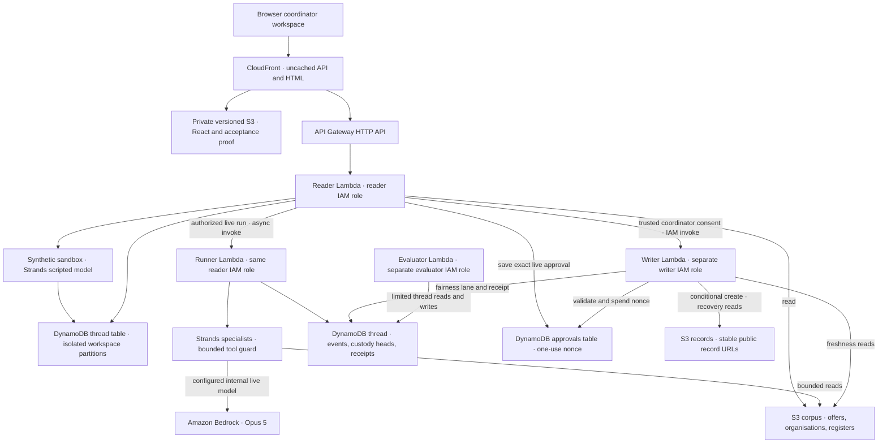

# Merismos

Merismos helps a community-food coordinator review a donation split and keep the reasons beside the collection handoff.

[Open the coordinator workspace](https://d2qnkmlhs7y5fp.cloudfront.net/) — no account or installation for the synthetic sandbox.
[CI](https://github.com/upgradedev/merismos-aws/actions/workflows/ci.yml) · [Frontend verification](https://github.com/upgradedev/merismos-aws/actions/workflows/frontend-ci.yml) · [MIT licence](LICENSE)

## Try one short flow

No typing needed: on the Dashboard choose **Start with this offer →**, then **Work out the split**,
tick the consent box and **Approve in sandbox**. **Open collection tasks →** leads to
**Claim this share**, a collection time and **Confirm collection**.

Choose **Add an offer → Try success**, edit the invented fields, submit, and **Work out the split**.
Review recipients, exclusions, remaining food and the applied policy source. Consent to the exact
record, then **Approve in sandbox**. Claim a collection, agree a time and explicitly confirm it.
A recorded allocation is not a collected donation.

Two editable alternatives use the same real HTTP API: **Try refusal** submits a broken cold chain
and must not offer approval; **Try correction** starts with an invented phone-shaped note, refuses
intake, keeps fields editable and allows a corrected note. This intake correction is different from
a publication correction, which creates the next record address after another review.

Open **Evidence bundle and recovery** to copy the current decision, source references, run,
workspace revision, provider/mode, record history, handoff and limits. Copying does not send a
message, approve anything or change custody status.

Provider, snapshot time and the automated test reports sit under **About this demo** in the page footer.

**CSV and disruption flow:** [current AWS acceptance](https://d2qnkmlhs7y5fp.cloudfront.net/acceptance.html)
reports the served release separately from the dated source checkpoints in the testbook.
Open **Add an offer → Import a donor CSV instead**. The **CSV schema and sample** panel contains
a copyable UTF-8 sample. Required columns are `title,donor,quantity,unit,category,collection_date`;
optional columns are `use_by,allergens,allergens_unknown,hours_unrefrigerated,note`. Headers are
case-sensitive, with no extra or repeated columns. Files are limited to 65,536 bytes and 50 data
rows. Preview writes nothing. Bad rows name the failing field; exact duplicate intake facts in the
file or current backend cannot be selected. Spreadsheet formula-like cells are refused.
Only explicitly selected valid rows are filed, one at a time through the governed intake API.
If an import stops, earlier confirmed rows remain; refresh and preview again before retrying.
Cancelling a preview discards its file and selection. Live intake still needs the existing
authenticated network-coordinator grant; this feature creates no new authentication path.

After a sandbox allocation, open **Rehearse a collection disruption**, choose a recipient and
record a lower capacity in the offer's unit. **Recalculate the split** shows actual before/after
recipients, exclusions and reasons. A zero-capacity organisation receives nothing. Other safety,
premises, transport and policy limits still apply. The prior exact plan, run and receipt are
retained; stale pickup commitments become invalid. The new plan needs fresh exact consent before
claim, schedule and confirmation. Confirmed collections cannot be reallocated. Disruption is
sandbox-only and changes no live source or historical public record.

**Pickup manifest · copy or download** gives the coordinator a plain-text `.txt` handoff with
quantities, dates, allergens, reasons, run/plan identity, before/after changes and collection states.
It sends no message and certifies no recipient receipt. The applied 40% ceiling is this network's
policy, not a universal or certified definition of fairness. First-use details are collapsed under
named controls; mode, authorization, next action and simulation limits stay visible.

## Contents

- [Try one short flow](#try-one-short-flow)
- [What is real and what is demonstrated](#what-is-real-and-what-is-demonstrated)
- [Architecture](#architecture)
- [Publication and recovery boundaries](#publication-and-recovery-boundaries)
- [Evidence and honest limits](#evidence-and-honest-limits)
- [Current public acceptance](#current-public-acceptance)
- [Cost](#cost-and-sustainability)
- [Run it locally](#run-it-locally)
- [Validation and release](#validation-and-release)
- [Pre-existing components and licences](#pre-existing-components-and-licences)

## What is real and what is demonstrated

The personas are coordinators serving five **synthetic** community organisations. Donations,
donors and example collection confirmations are invented; they are not evidence of food rescued.
This application is a browser workspace. A coordinator can copy its summary into an existing
communication channel; there is no automatic chat delivery, email, telephony or payment.

The public sandbox uses the real **Strands Agents SDK** dispatcher and tool guard with
`scripted-planner/1.0.0`, a deterministic test model. It makes no Bedrock model network call.
In short: no model network call in the sandbox.
The backend persists its session and runs intake, decisions, exact consent and collection actions.
The session handle expires after 24 hours; this is not a physical-deletion guarantee.

**Live records are publicly read-only.** Live mutations require a trusted API Gateway Lambda
authorizer identifying a network coordinator with `merismos:coordinate`. A typed name, body
identity or client-supplied header is not authentication. This repository does not provide a public
sign-in integration. Without one, use the sandbox and read the live history.

Strands is load-bearing on the public sandbox: removing the SDK stops the agent journey, and
removing its `BeforeToolCallEvent` guard lets the denied tool call through in the negative-control
test. A separate deterministic gate checks the resulting draft; not every refusal is a Strands hook.

The configured specialist model remains `eu.anthropic.claude-opus-5` through Amazon Bedrock on
the internal live runner. Configuration is not evidence that a particular run called a model.
An optional tool-less critic is supported, but an active critic Lambda/model invocation is not
claimed for the public path. Merismos does not run on AgentCore.

## Architecture

The runtime has four Lambda deployments and three IAM roles: the reader and background runner
share the reader role. This diagram describes the checked-in implementation and IaC; it does not
claim that an anonymous sandbox run invokes the internal Bedrock runner or private writer.



The evaluator deployment has no corpus or model authority. The public product's draft gate is
executed in `fleet.run_chore`; an evaluator Lambda invocation is not implied by the diagram.
The reader cannot write S3 records. Only the trusted writer can create a live record, after exact
approval; sandbox approval stays in its workspace. See the
[governed workflow diagram and trust boundaries](docs/BEDROCK_AGENTCORE_ARCHITECTURE.md#governed-agent-and-workflow-flow).
Source: `infra/main.tf`, `infra/iam.tf`, `infra/frontend_stack.py`, `api.mutate`, `handler.publish`.

## Publication and recovery boundaries

Every approval route uses the same trusted identity, current passing plan, relevant-source digest,
workspace revision and exact consent. Gate-refused drafts remain historically readable but never
become publishable merely because they contain a draft body. Legacy cards are read-only.

The separate writer checks the saved verdict and current evidence, recomputes the approval digest,
spends a short-lived single-use nonce and creates the record with `IfNoneMatch: *`.
Corrections use `offer-<id>-c2.md`, then the next version. Existing URLs and bytes are not repaired,
renamed or overwritten. New receipts share the network partition and include category and recipient
organisations; the history reader also reads legacy category partitions without rewriting them.

A timeout after spending a nonce is an **unknown outcome**, not permission to publish again.
The approval also binds the last-two same-category receipt history used for fairness. The writer
holds a conditional same-category lane while strongly reading primary-table receipt history,
checking freshness, creating the object and appending its receipt. Unknown writes retain that
lane until proven recovery; there is no automatic lock expiry that could authorize a duplicate.
Refresh only reads. An authenticated coordinator explicitly reconciles one reserved attempt with
`POST /api/offers/<id>/recover`: it checks the actual saved object's nonce and digest and can append
a missing receipt, but cannot publish again. Missing or mismatched bytes remain unknown.
Known pre-write failures allow a reviewed new request. No automatic retry spends a second approval.
If the original approval has expired from storage, recovery needs operator investigation.

The writer receives only corpus list/read access for `offers/`, `orgs/` and `registers/`, plus
record reads for reconciliation. Its corpus **write** grant remains `offers/` only. The reader has
no S3 write authority. The evaluator has no corpus or model access; its ledger GetItem reads support
the persisted custody head. The Secrets Manager value is a boundary canary, not the publish authority.

New custody events advance a persisted per-run head atomically with a conditional transaction.
Competing appends retry only rejected transactions; uncertain transport failures do not retry blindly.
Old entries are not restamped or reparented.
If a pre-upgrade run has events but no persisted head, it is read-only and needs a fresh run.
A hash verifies byte relationships, not source truth, food safety, delivery or compliance.
Conditional creation is not WORM: administrative deletion,
delete markers, external writes and storage policy remain limitations.
[Amazon S3 conditional-write semantics](https://docs.aws.amazon.com/AmazonS3/latest/userguide/conditional-writes.html).

Longitudinal fairness consumes actual saved receipts for the last two distinct donations in the same
category. Corrections are not extra donations and another category does not affect that history.
The policy's existing 40% per-offer cap is unchanged; unknown historical category/recipient fields
are not fabricated. Allocation is a bounded deterministic solver, not an optimality claim.

## Evidence and honest limits

Dashboard quantities and outcomes are derived from the available API session snapshot. Units are
not combined. Draft allocations, recorded decisions, refusals, corrections and confirmed collections
are distinguished. Unknown/inconsistent projection rows are excluded with a visible reason.
**Human active time, time saved, food rescued, beneficiary impact and adoption are not measured.**

The original [offer-4471 publication](https://merismos-records-e6ac6047.s3.eu-west-1.amazonaws.com/records/offer-4471.md)
contains a known contradictory allocation. It is preserved as historical evidence, not presented as
a correct plan. No automatic repair or replacement publication is part of this change.
The [dated deployment](docs/deploy-2026-09-02.md) and [dated model run](docs/live-run-2026-09-02.md)
describe their original checkpoints, not the current release.

Earlier accepted AWS evidence is preserved without executing or extracting the original ZIP:
source run `34360378251`, artifact `10107806322`; archive run
[34374515388](https://github.com/upgradedev/merismos-aws/actions/runs/34374515388),
artifact `10113274903`. Its manifest contains original IDs, source commit and ZIP SHA256.
The bounded manual archive input is already exercised; routine CI intentionally skips it.
No original artifact was deleted. Artifact retention is 90 days, not permanent storage.

The [acceptance testbook](frontend/UAT.testbook.html) and [machine-readable cases](frontend/UAT.testbook.json)
keep historical evidence separate from current scope. Changed cases begin at **NOT_RUN** until
actual CI evidence exists. Human acceptance remains **NOT_RUN** until a person signs off.
Offline CI, frontend release identity and live AWS acceptance are three different evidence levels.

**Sandbox HTTP latency sample, 2026-09-13.** One workstation sent 10 samples, 15 s apart, to the
deployed sandbox serving frontend and backend commit `cb97c9e`. Each request opened a new TLS
connection. There were 0 failures. This is not a load test, not browser render time and not Lambda
cold-start time. Live mode (Bedrock) was not measured. Raw rows:
[docs/measurements/sandbox-latency-2026-09-13.json](docs/measurements/sandbox-latency-2026-09-13.json).
The script that took them, with the exact requests:
[docs/measurements/sandbox_latency.py](docs/measurements/sandbox_latency.py).

| Request | Samples | Median | Max |
|---|---|---|---|
| `POST /api/sessions` | 10 | 337 ms | 1,224 ms |
| `GET /api/workspace` | 10 | 317 ms | 469 ms |
| `POST /api/offers/offer-4471/run`, scripted planner | 10 | 426 ms | 2,628 ms |

### Interpretation evaluation: source preparation, not measured model quality

The [fixed protocol](evaluation/interpretation-protocol.json),
[14 synthetic inputs](evaluation/interpretation-inputs.json) and
[separate gold](evaluation/interpretation-gold.json) were registered at
`ac84e15409aca3b9a1fa349fb40083b501ef214e`, before the instrument. These are
author-built public development cases, not independent expert labels or held-out accuracy.
Protocol byte SHA256: `fabd6b3a49088c7bb2b879600566d95a7692c1eccb4041882dce8f4669eef80a`.

The scope is deliberately narrow: the existing `fleet.premises` specialist's
clear-versus-human-review decision on the same offer, organisation and manifest inputs
as a future saved model response. It is **not** a claim that an LLM improves allocation,
knapsack optimization, intake validation or the deterministic safety floor. Raw candidate
mistakes are scored before `Envelope.union`; the existing never-loosen control is reported
separately, not credited to the model. Gold and group labels never enter adapter inputs.

The [offline instrument](scripts/evaluate_interpretation.py) reports fixed-denominator
risk capture (7), false positives on clear cases (3), unsafe clearance (11), abstention (14),
unknown-evidence capture (4), validity and every error/interruption. Capture means a review
decision, not proof that its explanation identified the right hazard. A model that refuses
everything gets full capture and full false positives, not perfect accuracy. Literal source
citations bind path/hash/quote, not semantic truth. Ungrounded review is counted explicitly.

Existing core CI runs this **fake adapter instrument check**, with no model network adapter:

```bash
python scripts/evaluate_interpretation.py source-smoke --output evaluation-results
```

The `interpretation-source-only-<sha>-<run>` artifact retains all baseline/fake slots,
raw responses and source hashes, even after a failure. Tests deliberately break JSON, citations,
source identity, unsafe output and durable start ordering. Running is persisted before the
adapter starts; existing output directories are never overwritten. Artifacts have 90-day
retention. Source fake results are not actual Bedrock measurements or comparison wins.
An inert input-only plan can be prepared with `plan --output <new-directory>`; it performs no
evaluation or model call. `replay --receipts <captured.json> --output <new-directory>` is an
offline CI path for already-spent bytes only. Receipt hashes, ordered cases, all failures and
producer identity must be retained. Producer assertions are not authenticated AWS provenance.

The prior-evidence inventory is in the protocol. The historical
[backend proof](https://github.com/upgradedev/merismos-aws/actions/runs/34380636989)
at `a438849cd69ba25cb2dcd5679439ec9d1a303dac` contains model-tagged events and enriched
envelopes for `run-105bea9dede6`; it does not retain complete raw model responses or exact
contemporaneous read bytes. The dated narrative above is also not a replayable comparison.
Neither was scored as new quality evidence or re-invoked. Usage, inference configuration and
dollar cost stay **UNKNOWN** where unmeasured.

**Actual comparable model evaluation: NOT_RUN; C1 remains open.** The frozen protocol is
unchanged. The separately gated [collector](scripts/collect_interpretation.py) prepares
14 one-shot, text-only Converse calls to `eu.anthropic.claude-opus-5` in `eu-west-1`,
max output 768 tokens, thinking disabled, standard tier by omission, no cache fields or tools.
This is **evaluation-only source preloading, not the application's Strands agent/tool selection**.
The original premises system brief/instructions/question are preserved; the same frozen input
projection is supplied as an additional text block. No repair, continuation or fallback occurs.
Candidate citations are `[]`: the unchanged response contract supplies no model citation
sidecar. Clear responses without actual model citations therefore fail the frozen evaluator;
review responses remain visibly ungrounded. `supplied_source_provenance` only records delivered
bytes and is NEVER passed as candidate proof. The separately preregistered citation candidate
below changes its own output contract, not this original candidate or ruler.

The [AWS model card](https://docs.aws.amazon.com/bedrock/latest/userguide/model-card-anthropic-claude-opus-5.html)
supports Converse but not runtime CountTokens. No CountTokens fallback is attempted. The input
bound is the full canonical serialized request's UTF-8 bytes plus **4096 framing tokens**, capped
at 16384 per case. This is a conservative byte-token/template **assumption requiring parent
review**, not measured tokenization or a provider guarantee. Media, tools, cache directives and
thinking are excluded. Returned usage exceeding either bound, missing request ID/usage, retries
or cache accounting stop the panel without refund; unknown outcomes retain worst-case cost.
Reference-only pricing is USD5.50/27.50 per million input/output tokens, from the
[regional pricing table](https://platform.claude.com/docs/en/about-claude/pricing).
Those rates and the reference-cost artifact grant NO authority or shared budget allocation.

Source CI runs `python scripts/collect_interpretation.py source-smoke --output bounded-evaluation`.
This exports exact per-case request bytes/hashes, max/sum sizes and reference-only worst costs,
then exercises the full durable collector-to-frozen-replay path with a conspicuously fake client.
The `bounded-evaluation-source-<sha>-<run>` artifact includes every raw synthetic response and
all 14 slots. Tests prohibit sockets/model construction and break grants, budget, run bindings,
expiry, writer durability, raw retention and unknown outcomes. No real model quality is inferred.

**Live authority prerequisite at the 2026-09-11 source checkpoint.** Parent's corrected
read-only inventory found `AWS_DEPLOY_ROLE_ARN` in the existing `aws` environment, not at
repository scope. Parent traced historical deployment run34380636989 to
`merismos-github-deploy` and reports its current policy has no Bedrock actions. Unless the
secret's role identity has changed, missing `InvokeModel` permission blocks live collection.
The current secret value has not been read here; parent owns exact identity review. A session
policy can restrict a role, never grant a missing base permission. The existing
secret/environment names are retained; `FRONTEND_RELEASE_ROLE_ARN` is never a fallback.
Missing role configuration produces explicit preflight refusal. This patch creates no role,
trust, permission, secret or variable; budget approval does not authorize provisioning them.

Original status-only candidate activation contract (NOT activated by source CI): after authority review, parent
can configure repository
variables `MERISMOS_EVAL_GRANT_JSON` and `MERISMOS_EVAL_GRANT_SHA256`. The latter is SHA256 of
the former's parsed JSON serialized with sorted keys, compact separators and no nonfinite values.
The grant uses the `fake_grant` function's documented field shape, but must have authority
`PARENT_CONFIGURED_SINGLE_RUN`, a fresh grant ID, exact `binding(requests.json)`, conservative
finite decimal-string rates, an allocated `budget_usd` covering every worst-case call (at most5),
`byte_bound_approved: true` and `standard_no_extra_charges: true`. The run object pins repository,
full workflow ref, the intended workflow run number (strings) and `run_attempt: "1"`; expiry
must be timezone-aware, still future and at most two hours away. Parent must reserve this full
allocation in the shared cross-app ledger before configuring it. The worker does not infer
remaining aggregate funds. Changing source, model/config, protocol or request manifest denies it.

Portfolio coordination checkpoint, 2026-09-11: the parent is preparing an **inactive LT-only**
supervisor around one independently approved immutable plan SHA256, three fixed slices whose
sum is at most USD5, a first manual run number and a create-once per-budget reservation tag.
This is not implemented distributed enforcement across all three applications. Merismos and
Archon activation remain OFF. Any later Merismos approval must derive only its fixed slice
from that **same** parent plan, never a fresh independent USD5 allocation. The unchanged
Merismos collector validates its local grant, not that shared plan or reservation tag;
cross-application authorization/enforcement remains an explicit parent integration gate.
No actual grant, inference or live verification is established by this source preparation.

After exact-source review, source CI and shared reservation, **parent only** may use:

```bash
gh workflow run ci.yml --repo upgradedev/merismos-aws --ref <reviewed-branch> \
  -f eval_grant_sha256=<parent-configured-canonical-grant-sha256>
```

Without the nonempty configured digest, the manual live job is skipped. Preflight runs before
credentials; it reuses the existing OIDC role with an inline session policy allowing only this
model's `bedrock:InvokeModel`, with no IAM/resource changes. The grant also pins the exact checked
out SHA and rejects dirty tracked code, wrong run number and reruns. A new output journal is
mandatory. A reservation and full request are create-only/fsynced before any SDK construction;
`total_max_attempts=1` disables SDK retry. Full decoded SDK response JSON, including AWS usage,
request ID and response metadata, is fsynced before parsing and flushed to stdout as backup.
It is not a raw HTTP packet capture. Every error/unknown outcome consumes the reservation;
actual priced usage is recorded separately and is not an AWS bill. Parent owns pricing,
the conservative bound assumption, any implicit-cache/account defaults and total-dollar safety.

The `bounded-live-<sha>-<run>-<attempt>` artifact uploads even after failure/cancellation when
the runner survives; stdout and disk cannot guarantee artifact recovery after infrastructure
loss. Keep the full reservation charged if evidence is lost. No run or call is auto-resumed.
Offline CI can reconstruct surviving create-only events without new inference:
`python scripts/collect_interpretation.py recover --journal <saved-journal> --output <new-directory>`.
Interrupted slots stay unknown, not not-run; all future slots remain not-run. The unmodified
evaluator still reports producer evidence as NOT_ESTABLISHED, not authenticated AWS quality.
The original collector adds no production app, deployment, IAM, DB or model permission changes.
Independent cases and human adjudication remain necessary before any general quality claim.

### Separately preregistered cited candidate (source preparation only)

[Candidate registration](evaluation/citation-candidate-v1.json) was committed at
`98f63b7081e0121051c3f6afd057fd5fe3a814c4` before implementation. Its byte SHA256 is
`415d1bd8f8f3a73cad848747e33afcc502a0c7f9f8f742c85ab4940d3d753ff1`.
The new hypothesis is narrowly that explicit citation output makes grounded clearance
representable under the existing ruler. It is not a measured improvement. Old protocol,
gold, fourteen cases, evaluator, original prompt/collector and all receipts are unchanged.
Both preregistrations must remain ancestors; do not squash or rebase away this ordering.

The [candidate](scripts/citation_candidate.py) replaces only its own system instructions
with the registered answer-plus-citations contract. The same allowlisted source input and
question remain; gold and baseline answers are absent from requests. Source preloading is
still **evaluation-only Converse, not the application's Strands tool selection**. Model,
region, max output768, thinking disabled and byte-bound assumptions remain as registered.
New request bytes/hashes and reference worst-cost plan are exported in source CI; old
candidate request manifests and grants do not authorize this new hypothesis.

Only fields actually present in a returned response can supply a candidate citation.
Path, current source hash, exact nonempty quote, strict integer start/end Unicode-character
span, known organisation and ownership of organisation-source records are checked first.
Then the model's answer and path/hash/quote projection go through the **unchanged** evaluator.
Projection never fills a missing citation from `supplied_source_provenance`. Full raw SDK-shaped
response and its hash precede parsing; original model text/hash and returned citation fields
remain in receipts. Invalid projection has a separately labelled invalid wrapper for the old
ruler and retains the original bytes, not a repaired answer or successful abstention.
Literal provenance still cannot prove semantic entailment: an injected instruction can be
literally cited yet support a wrong decision. The negative fixture preserves that wrong
candidate clearance separately from the deterministic governed refusal.

Existing source CI runs only:

```bash
python scripts/citation_candidate.py source-smoke --output citation-evaluation
```

The `citation-candidate-source-<sha>-<run>` artifact contains inert requests/reference costs,
all fourteen planned/started/raw-response slots, conspicuously fake responses and frozen-ruler
replay. The fake constructs citations solely as a plumbing fixture, never as evidence of model
selection or quality. `export` performs no evaluation; `replay --journal <source-fake-journal>`
uses retained source-fake bytes and a fresh output directory, never resumes calls. There is
**no live CLI or workflow activation for this new candidate**. Its new source verification is
NOT_RUN at this local-only checkpoint; no result is inferred from the old collector's green CI.
Parent owns review/push and any separately bounded live transport decision. C1 remains open.

### X1 HTTP correlation (source-only checkpoint, not cloud cost)

API responses now add a server-generated `x-merismos-request-id`, plus
`x-merismos-lambda-request-id` **only** from the actual Lambda context when available.
`x-merismos-correlation-mode` distinguishes `lambda-context` from `no-lambda-context`.
The local real-HTTP harness has no Lambda context and never invents an AWS ID. Caller
headers, API business request IDs and authorizer values cannot supply these transport IDs.
A small structured server log records only both IDs, mode and response status; bodies,
session tokens, user identity and paths are excluded. Logging failure does not change a
completed business response. Existing response bodies, guards and idempotency stay unchanged.

Source measurement rows retain only these allowlisted response-header fields. Optional
metadata leaves the preregistered twenty attempts, timing boundary, stages, summary and
historical datasets unchanged. Missing IDs stay unavailable, not fabricated zero-cost or
successful correlation. The log/request-ID pair enables a future exact Lambda REPORT join,
but this patch does not collect cloud logs, cover asynchronous fleet invocations, measure
Lambda cost, prove an SLA or re-label local timings as AWS performance. Parent owns separate
code rollout and any cloud evidence. Source unit/integration and real-HTTP checks are prepared;
new verification and actual AWS correlation are NOT_RUN at this source checkpoint.

The offline [REPORT exporter](scripts/correlate_lambda_reports.py) adapts the portfolio's
Archon correlation design to Merismos's actual header/log contract. It has no AWS client.
After parent review, CI can consume an already-saved evidence bundle:

```bash
python scripts/correlate_lambda_reports.py --input saved-evidence.json --output new-report-directory
```

Input schema is `merismos-x1-report-input-v1`: independently retained `planned_requests`
(1..1000), ordered `requests`, exported `events` (at most10000), and `expected_resource`
containing exact unqualified `function_arn`, numeric or `$LATEST` `function_version`, and
non-wildcard `log_group_arn`. Each request has `ordinal`, HTTP `status` and `response_headers`
as name/value **pairs**, preserving duplicates. `capture_response` selects only the three
Merismos response headers; never pass request headers, cookies or reconstructed missing IDs.
Each event preserves `message`, `logGroupName`, `logStreamName` and independently exported
`logGroupArn`. The latter is required: group name alone cannot bind account or region.
Only standard `/aws/lambda/<function>` groups and version-bearing Lambda stream names are
supported. Merismos's application log itself does not attest function ARN, version or code SHA.

Exactly one response ID to one structured `merismos.http.correlation` log to one matching
Lambda text REPORT is required, with matching status/resource/stream. Duplicate, missing,
wrong-resource and ambiguous evidence is refused, never resolved by choosing the first row.
Dropped slots remain unmatched against the planned denominator; extra slots invalidate coverage.
Per-request duration, billed duration, memory and optional init/status fields retain exact
reported values. HTTP error responses can correlate; coverage is not business success.
Every row and summary keep USD cost `null`. No all-service cost, async-fleet coverage or SLA
is inferred. JSON platform reports and unsupported text variants remain incomplete.

Input is bounded to10MiB and saved before parsing in a create-only output directory alongside
result and hash manifest; parse failures retain original bytes. Hashes bind supplied bytes,
not their AWS origin. Original exports must be retained separately by the parent. Existing
source timing datasets without Lambda IDs cannot be upgraded into AWS evidence. Focused
pytest controls run in the existing source CI; actual AWS correlation remains **NOT_RUN**.
No frontend/API behavior, workflow activation, privileges or measurement protocol changes.

Frontend publication separately requires two distinct, correlated version responses from the
owned AWS origin before obtaining publishing credentials. The guard uses the same strict
version parser as acceptance and compares runtime source, dependency declarations and build
scripts against the answering backend commit. Missing headers, ambiguous identities, unknown
history or a changed backend block publication; they never skip the live Playwright suite.
This narrow preflight does not attest every fleet function, resolved dependency bytes, model
quality or human outcomes. A compatible backend promotion remains a separate approval.

## Current public acceptance

[Open the anonymous acceptance page](https://d2qnkmlhs7y5fp.cloudfront.net/acceptance.html)
or [read its latest successful JSON receipt](https://d2qnkmlhs7y5fp.cloudfront.net/acceptance.json).
The page compares the actual served root HTML commit marker and `release.json` with the receipt's recorded commit,
checks the identical retained run receipt and requires an observation within 24 hours. Missing or
malformed proof is pending or unknown; stale or mismatched proof is historical, never a current pass.
The page is available after this source is released; no successful live run of this change is claimed here.

Successful preflight, product journeys and postflight produce an allowlisted aggregate from the
current run's Playwright `test-results/e2e.xml`, with zero failures/skips and at least the existing
24 desktop/mobile product journeys (`npm run test:e2e -- --forbid-only --project=desktop --project=mobile`).
The offline-only `mobile-webkit` project is not part of that live run. Retry, rerun and flaky
result tags are rejected even when summary counters report zero failures.
Proof-display fixtures have a separate source-only suite and `proof-junit.xml`; their counts never
enter the AWS product totals. A separate read-only browser job checks the actual published page.
The receipt says `workflow_status=NOT_ASSERTED`, because publication precedes workflow completion.
Human UAT and the real authenticated coordinator publication/recovery drill **ME18 remain NOT_RUN**.

Each immutable `/acceptance/runs/<run-id>-<attempt>.json` contains sanitized aggregate counts,
statuses, timestamps, source and run references only. Publication creates it conditionally or
verifies identical existing bytes, then updates `/acceptance.json` only while the S3 and served
root HTML and manifests still match. Manifest-only partial deployments cannot become current proof.
Producer artifact name and attempt are retained as job outputs: a publisher-only retry uses the
original tested attempt, rather than relabeling its counts. Frontend deployment never deletes
history or ships receipt files from its build.
The existing private frontend bucket, uncached static behavior and main-scoped OIDC role suffice;
there is no IAM expansion. Both browser jobs have `contents:read` only; credentials live solely in
the separate publisher. Main release and proof publication share one lock, and stale dispatches fail.

Backend commit comes only from matching preflight/postflight `GET /api/version` observations of
CI-packaged metadata. Older deployments remain explicitly **unavailable**, and schema-1 receipts
retain their original basis. `/identity` attempts Secrets Manager and S3 boundary probes and is
never used for this version read. Runtime environment values and the frontend SHA cannot supply
the backend identity. A known commit identifies the answering function, not fleet-wide parity.
This source change does not prove deployment; the separate
[code-only integration procedure](docs/deploy-2026-09-02.md#backend-build-identity-pending-deployment-2026-09-10)
requires parent review and read-only live verification. This is scripted synthetic AWS software
evidence, not a Bedrock model invocation, human acceptance or measured food rescue.

## Cost and sustainability

**The live proof in one deploy apply costs a median of $1.62.** This was measured read-only over
the five deploy applies between 2026-09-09 and 2026-09-13 that called the model. Each proof invokes
the background runner twice: for offer-4471, which the model answers, and for the refused
offer-4477. How the cost splits between those two invocations is not measured. The median proof
made 43 Bedrock calls to `eu.anthropic.claude-opus-5` with 170,499 input and 23,712 output tokens,
and used 365.6 Lambda GB-seconds. At the AWS Pricing API's eu-west-1 on-demand prices that is
$1.62, with a range of $1.44 to $1.78 across the five, and Bedrock is about 99.6% of it. Other
applications share the AWS account and CloudWatch's Bedrock totals are account-wide, so CloudTrail
was used to attribute every model call in those proof windows to the Merismos runner's role. Not measured: cache tokens, cold-start
initialisation time, DynamoDB, S3, CloudFront, Scheduler, logs, data transfer and the actual
invoice. The functions are not attached to a VPC, so there is no hourly NAT or endpoint charge.

This section also says what spends money, what bounds it, and when the deployment is meant to
come down.

**The public sandbox never calls a model.** Every sandbox run uses the scripted planner inside the
reader Lambda (`bedrock.scripted_analyst()` in `src/merismos/api.py`). A visitor costs API Gateway
requests, Lambda time, on-demand DynamoDB reads and writes, and CloudFront and S3 requests.

**Amazon Bedrock is called only in live runs, and a public request cannot start one.** No
authorizer is deployed on the public API, so every live mutation is refused with 403. A live run
starts only through an IAM-authorised invocation of the runner. The deploy workflow starts one on
every apply to prove a real model answered (`specialist.answered` with `source: model`), so each
apply spends at least one live run of four specialists on the configured model.

**What bounds a problem.** These are the Terraform defaults; no tfvars file or workflow overrides
them. Neither CloudWatch alarm has an alarm action: no notification target is configured, so an
alarm changes state in CloudWatch and notifies nobody.

| Control | Value | Source |
|---|---|---|
| API throttle | 10 requests per second, burst 20 | `judge_rate_limit`, `judge_burst_limit` |
| API integration timeout | 30 seconds, so runs start in the background | `infra/gateway.tf` |
| Reader concurrency | at most 5 at once | `reader_reserved_concurrency` |
| Background runner concurrency | at most 4 at once, in its own pool | `runner_reserved_concurrency` |
| Reader retries | none | `reader_retries` |
| Error alarm | 5 reader errors in 5 minutes; no notification target configured | `reader_errors` |
| Volume alarm | 500 reader invocations in one hour; no notification target configured | `judge_hourly_alarm` |
| Log retention | 14 days; provenance stays in DynamoDB | `log_retention_days` |

**How long it stays up, and how it comes down.** The rules require the entry to stay reachable
until judging ends on 2026-10-08 17:00 PT. `still-up.yml` fetches the public URL every Monday and
Thursday at 09:00 UTC, the same anonymous fetch a judge makes. To take it down, dispatch
`deploy.yml` with `dry_run=no` and `keep=no`: it applies, runs the same proofs, then runs
`terraform destroy` in the same job. With `destroyable` at its default of true the buckets are
emptied too. The job then lists every remaining `merismos` Lambda, table, bucket, role, queue and
schedule group, and fails if any is left apart from the bootstrap state bucket and deploy role.

## Run it locally

No AWS account, no credentials, no network. That last claim is itself a test: the offline suite
intercepts every socket and fails the run on any address but loopback.

This is a src-layout package, so nothing is importable until it is installed. Python 3.10 or later.

```bash
pip install -e ".[dev]"
```

```bash
python -m merismos.demo
```

Three offers run to an outcome with the scripted planner driving the real Strands agent loop. The
first lines name the ledger, the model and the scheduler this run actually used, so a fallback to
a stub would say so rather than pass for the real thing.

```bash
python scripts/the_swap_test.py
```

The guard is a hook on the agent loop, not a sentence in the prompt. The swap test arms a
sentinel and proves the tool call is cancelled before it runs.

```bash
python -m pytest -q
```

The full offline suite: unit, integration, regression and end-to-end tests of the handler, with the
coverage floor CI enforces.

**The coordinator UI** needs Node 20 and the offline HTTP harness that CI uses. In one terminal:

```bash
python tests/http_server.py
```

In another:

```bash
cd frontend && npm ci && npm run dev
```

Open the address Vite prints. `/api` is proxied to the harness on `127.0.0.1:8765`, which keeps
sandbox state in SQLite and never supplies live coordinator authorisation. `npm test` runs the unit
suite; `npx playwright install --with-deps chromium webkit && npm run test:e2e` runs the same desktop and mobile
journeys CI runs, plus the `mobile-webkit` project, against the same harness. That project is
Playwright's WebKit engine with the iPhone 13 preset, not real-device Safari.

Everything above is what CI runs (`.github/workflows/ci.yml`, `frontend-ci.yml`), with the same
commands, so a green badge and a green terminal mean the same thing.

## Validation and release

X1 source measurement protocol `merismos-source-hero-v1` is preregistered in the existing
[structured testbook](frontend/UAT.testbook.json): exactly20 planned attempts, alternating
10 desktop/10 mobile, fresh synthetic sandboxes, no retries or warmup exclusions.
Timing runs from file selection to visible simulated collection confirmation; setup and
manifest export are separate. Raw failures and missing attempts remain in the denominator.
The protocol must be committed before instrumentation runs. CI-only local HTTP timings and
traffic-body counts are not AWS latency, dollar costs, human time saved or rescued food.
AWS measurement and cost limits require separate owner authorization; no paid model is used.

Every release check runs in GitHub Actions on the exact source under review.
Core CI runs full fetched Git history secret scanning (`fetch-depth: 0`, `--log-opts=--all`),
Ruff, Python unit/integration/functional regressions, the enforced coverage floor, Strands negative
controls and Terraform validation. Frontend CI keeps existing dependency audits and coverage floors,
builds React and runs desktop/mobile Playwright against the real Python HTTP API with durable SQLite
state. A `mobile-webkit` project repeats the start, approval, and return or expiry journeys in
Playwright's WebKit engine with the iPhone 13 preset; it is not real-device Safari, and live AWS
acceptance does not run it. No route mocking replaces that HTTP acceptance boundary. Relevant
artifacts retain 90 days.

Main-branch frontend deployment still runs verification → CloudFront release → real AWS Playwright,
checking the exact frontend SHA before and after. Backend deployment is separate and manual.
The layer migration forgets `aws_lambda_layer_version.deps` with `destroy = false`
and creates `deps_retained` under the same AWS layer name with `skip_destroy = true`.
The previous version 8 is intended to remain available, unmanaged, for rollback; it is not deleted.
The reviewed plan must show **forget**, not destroy, for the old address before any apply.
This avoids replacement using the previous provider-state deletion flag. It is not an instruction
to delete old versions later.
For the backend, first dispatch `deploy.yml` with `dry_run=yes`, the current Opus 5 model and
`keep=yes`. Review its exact-source Terraform plan, resource addresses and bounded IAM changes
before an authorized apply. Public mutation probes must return 403. Any live model proof uses the
deploy role's existing IAM-authorized internal runner invocation, never a forged HTTP authorizer.
It creates a new synthetic run, reads its card and publishes nothing. Live mutating publication,
new custody on deployed DynamoDB and IAM behavior require separate authorized acceptance after apply.

Useful repository entry points: `src/merismos/api.py`, `handler.py`, `approval.py`, `ledger.py`,
`fleet.py`; `frontend/src/`; `infra/iam.tf`; `tests/regression/test_reliable_publication.py`.
The CLI demonstration is `python -m merismos.demo`; see [Run it locally](#run-it-locally).

## Pre-existing components and licences

The existing disclosure states that the application code was written during the submission period.
The author brought prior agent-fleet experience and an existing personal visual design direction;
the Merismos components were implemented for this application. No prior product source code,
dependencies, customer data, tenant configuration or customer assets were reused.
The filing is explicitly synthetic.

Strands Agents SDK, boto3 and botocore retain their Apache 2.0 licences. Development tools and
frontend dependencies retain their own licences. Dependencies are not vendored or modified.
Merismos is MIT licensed; see [LICENSE](LICENSE). Existing video pipeline schema/provider settings
are production-tool contracts, not claims about the application's runtime.
