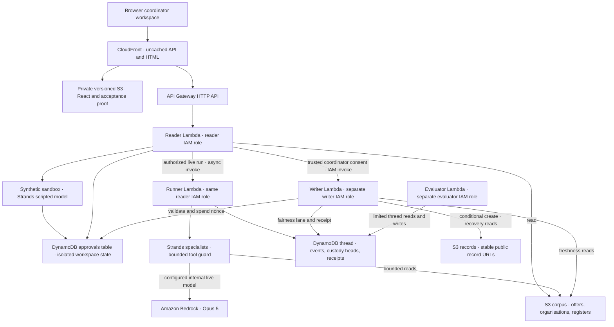

# Merismos

Merismos helps a community-food coordinator review a donation split and keep the reasons beside the collection handoff.

[Open the coordinator workspace](https://d2qnkmlhs7y5fp.cloudfront.net/) — no account or installation for the synthetic sandbox.
[CI](https://github.com/upgradedev/merismos-aws/actions/workflows/ci.yml) · [Frontend verification](https://github.com/upgradedev/merismos-aws/actions/workflows/frontend-ci.yml) · [MIT licence](LICENSE)

## Contents

- [Try one short flow](#try-one-short-flow)
- [What is real and what is demonstrated](#what-is-real-and-what-is-demonstrated)
- [Architecture](#architecture)
- [Publication and recovery boundaries](#publication-and-recovery-boundaries)
- [Evidence and honest limits](#evidence-and-honest-limits)
- [Current public acceptance](#current-public-acceptance)
- [Validation and release](#validation-and-release)
- [Pre-existing components and licences](#pre-existing-components-and-licences)

## Try one short flow

Choose **Add an offer → Try success**, edit the invented fields, submit, and **Work out the split**.
Review recipients, exclusions, remaining food and the applied policy source. Consent to the exact
record, then **Approve in sandbox**. Claim a collection, agree a time and explicitly confirm it.
A recorded allocation is not a collected donation.

Two editable alternatives use the same real HTTP API: **Try refusal** submits a broken cold chain
and must not offer approval; **Try correction** starts with an invented phone-shaped note, refuses
intake, keeps fields editable and allows a corrected note. This intake correction is different from
a publication correction, which creates the next record address after another review.

Open **Evidence bundle and recovery** to copy the current decision, source references, run,
workspace revision, provider/mode, record history, handoff and limits. Copying does not send a
message, approve anything or change custody status.

## What is real and what is demonstrated

The personas are coordinators serving five **synthetic** community organisations. Donations,
donors and example collection confirmations are invented; they are not evidence of food rescued.
This application is a browser workspace. A coordinator can copy its summary into an existing
communication channel; there is no automatic chat delivery, email, telephony or payment.

The public sandbox uses the real **Strands Agents SDK** dispatcher and tool guard with
`scripted-planner/1.0.0`, a deterministic test model. It makes no Bedrock model network call.
In short: no model network call in the sandbox.
The backend persists its session and runs intake, decisions, exact consent and collection actions.
The session handle expires after 24 hours; this is not a physical-deletion guarantee.

**Live records are publicly read-only.** Live mutations require a trusted API Gateway Lambda
authorizer identifying a network coordinator with `merismos:coordinate`. A typed name, body
identity or client-supplied header is not authentication. This repository does not provide a public
sign-in integration. Without one, use the sandbox and read the live history.

Strands is load-bearing on the public sandbox: removing the SDK stops the agent journey, and
removing its `BeforeToolCallEvent` guard lets the denied tool call through in the negative-control
test. A separate deterministic gate checks the resulting draft; not every refusal is a Strands hook.

The configured specialist model remains `eu.anthropic.claude-opus-5` through Amazon Bedrock on
the internal live runner. Configuration is not evidence that a particular run called a model.
An optional tool-less critic is supported, but an active critic Lambda/model invocation is not
claimed for the public path. Merismos does not run on AgentCore.

## Architecture

The runtime has four Lambda deployments and three IAM roles: the reader and background runner
share the reader role. This diagram describes the checked-in implementation and IaC; it does not
claim that an anonymous sandbox run invokes the internal Bedrock runner or private writer.

The evaluator deployment has no corpus or model authority. The public product's draft gate is
executed in `fleet.run_chore`; an evaluator Lambda invocation is not implied by the diagram.
The reader cannot write S3 records. Only the trusted writer can create a live record, after exact
approval; sandbox approval stays in its workspace. See the
[governed workflow diagram and trust boundaries](docs/BEDROCK_AGENTCORE_ARCHITECTURE.md#governed-agent-and-workflow-flow).
Source: `infra/main.tf`, `infra/iam.tf`, `infra/frontend_stack.py`, `api.mutate`, `handler.publish`.

## Publication and recovery boundaries

Every approval route uses the same trusted identity, current passing plan, relevant-source digest,
workspace revision and exact consent. Gate-refused drafts remain historically readable but never
become publishable merely because they contain a draft body. Legacy cards are read-only.

The separate writer checks the saved verdict and current evidence, recomputes the approval digest,
spends a short-lived single-use nonce and creates the record with `IfNoneMatch: *`.
Corrections use `offer-<id>-c2.md`, then the next version. Existing URLs and bytes are not repaired,
renamed or overwritten. New receipts share the network partition and include category and recipient
organisations; the history reader also reads legacy category partitions without rewriting them.

A timeout after spending a nonce is an **unknown outcome**, not permission to publish again.
The approval also binds the last-two same-category receipt history used for fairness. The writer
holds a conditional same-category lane while strongly reading primary-table receipt history,
checking freshness, creating the object and appending its receipt. Unknown writes retain that
lane until proven recovery; there is no automatic lock expiry that could authorize a duplicate.
Refresh only reads. An authenticated coordinator explicitly reconciles one reserved attempt with
`POST /api/offers/<id>/recover`: it checks the actual saved object's nonce and digest and can append
a missing receipt, but cannot publish again. Missing or mismatched bytes remain unknown.
Known pre-write failures allow a reviewed new request. No automatic retry spends a second approval.
If the original approval has expired from storage, recovery needs operator investigation.

The writer receives only corpus list/read access for `offers/`, `orgs/` and `registers/`, plus
record reads for reconciliation. Its corpus **write** grant remains `offers/` only. The reader has
no S3 write authority. The evaluator has no corpus or model access; its ledger GetItem reads support
the persisted custody head. The Secrets Manager value is a boundary canary, not the publish authority.

New custody events advance a persisted per-run head atomically with a conditional transaction.
Competing appends retry only rejected transactions; uncertain transport failures do not retry blindly.
Old entries are not restamped or reparented.
If a pre-upgrade run has events but no persisted head, it is read-only and needs a fresh run.
A hash verifies byte relationships, not source truth, food safety, delivery or compliance.
Conditional creation is not WORM: administrative deletion,
delete markers, external writes and storage policy remain limitations.
[Amazon S3 conditional-write semantics](https://docs.aws.amazon.com/AmazonS3/latest/userguide/conditional-writes.html).

Longitudinal fairness consumes actual saved receipts for the last two distinct donations in the same
category. Corrections are not extra donations and another category does not affect that history.
The policy's existing 40% per-offer cap is unchanged; unknown historical category/recipient fields
are not fabricated. Allocation is a bounded deterministic solver, not an optimality claim.

## Evidence and honest limits

Dashboard quantities and outcomes are derived from the available API session snapshot. Units are
not combined. Draft allocations, recorded decisions, refusals, corrections and confirmed collections
are distinguished. Unknown/inconsistent projection rows are excluded with a visible reason.
**Human active time, time saved, food rescued, beneficiary impact and adoption are not measured.**

The original [offer-4471 publication](https://merismos-records-e6ac6047.s3.eu-west-1.amazonaws.com/records/offer-4471.md)
contains a known contradictory allocation. It is preserved as historical evidence, not presented as
a correct plan. No automatic repair or replacement publication is part of this change.
The [dated deployment](docs/deploy-2026-09-02.md) and [dated model run](docs/live-run-2026-09-02.md)
describe their original checkpoints, not the current release.

Earlier accepted AWS evidence is preserved without executing or extracting the original ZIP:
source run `34360378251`, artifact `10107806322`; archive run
[34374515388](https://github.com/upgradedev/merismos-aws/actions/runs/34374515388),
artifact `10113274903`. Its manifest contains original IDs, source commit and ZIP SHA256.
The bounded manual archive input is already exercised; routine CI intentionally skips it.
No original artifact was deleted. Artifact retention is 90 days, not permanent storage.

The [acceptance testbook](frontend/UAT.testbook.html) and [machine-readable cases](frontend/UAT.testbook.json)
keep historical evidence separate from current scope. Changed cases begin at **NOT_RUN** until
actual CI evidence exists. Human acceptance remains **NOT_RUN** until a person signs off.
Offline CI, frontend release identity and live AWS acceptance are three different evidence levels.

## Current public acceptance

[Open the anonymous acceptance page](https://d2qnkmlhs7y5fp.cloudfront.net/acceptance.html)
or [read its latest JSON receipt](https://d2qnkmlhs7y5fp.cloudfront.net/acceptance.json).
The page compares the served `release.json` frontend commit with the receipt's recorded commit,
checks the identical retained run receipt and requires an observation within 24 hours. Missing or
malformed proof is pending or unknown; stale or mismatched proof is historical, never a current pass.
The page is available after this source is released; no successful live run of this change is claimed here.

Successful preflight, product journeys and postflight produce an allowlisted aggregate from the
current run's Playwright `test-results/e2e.xml`, with zero failures/skips and nonzero executed cases.
Proof-display fixtures have a separate source-only suite and `proof-junit.xml`; their counts never
enter the AWS product totals. A separate read-only browser job checks the actual published page.
The receipt says `workflow_status=NOT_ASSERTED`, because publication precedes workflow completion.
Human UAT and the real authenticated coordinator publication/recovery drill **ME18 remain NOT_RUN**.

Each immutable `/acceptance/runs/<run-id>-<attempt>.json` contains sanitized aggregate counts,
statuses, timestamps, source and run references only. Publication creates it conditionally or
verifies identical existing bytes, then updates `/acceptance.json` only while the deployed frontend
still matches. Frontend deployment never deletes history or ships receipt files from its build.
The existing private frontend bucket, uncached static behavior and main-scoped OIDC role suffice;
there is no IAM expansion. Both browser jobs have `contents:read` only; credentials live solely in
the separate publisher. Main release and proof publication share one lock, and stale dispatches fail.

Backend commit is explicitly **unavailable**, with a basis in each receipt: `/identity` attempts
Secrets Manager and S3 boundary probes, so it is not used as a harmless version read. There is no
backend parity claim or backend deployment to stamp a frontend SHA. This is scripted synthetic AWS
software evidence, not a Bedrock model invocation, human acceptance or measured food rescue.

## Validation and release

All dependency installation, builds and tests for this workspace run in GitHub Actions.
Core CI runs full fetched Git history secret scanning (`fetch-depth: 0`, `--log-opts=--all`),
Ruff, Python unit/integration/functional regressions, the enforced coverage floor, Strands negative
controls and Terraform validation. Frontend CI keeps existing dependency audits and coverage floors,
builds React and runs desktop/mobile Playwright against the real Python HTTP API with durable SQLite
state. No route mocking replaces that HTTP acceptance boundary. Relevant artifacts retain 90 days.

Main-branch frontend deployment still runs verification → CloudFront release → real AWS Playwright,
checking the exact frontend SHA before and after. Backend deployment is separate and manual.
The layer migration forgets `aws_lambda_layer_version.deps` with `destroy = false`
and creates `deps_retained` under the same AWS layer name with `skip_destroy = true`.
The previous version 8 is intended to remain available, unmanaged, for rollback; it is not deleted.
The reviewed plan must show **forget**, not destroy, for the old address before any apply.
This avoids replacement using the previous provider-state deletion flag. It is not an instruction
to delete old versions later.
For the backend, first dispatch `deploy.yml` with `dry_run=yes`, the current Opus 5 model and
`keep=yes`. Review its exact-source Terraform plan, resource addresses and bounded IAM changes
before an authorized apply. Public mutation probes must return 403. Any live model proof uses the
deploy role's existing IAM-authorized internal runner invocation, never a forged HTTP authorizer.
It creates a new synthetic run, reads its card and publishes nothing. Live mutating publication,
new custody on deployed DynamoDB and IAM behavior require separate authorized acceptance after apply.

Useful repository entry points: `src/merismos/api.py`, `handler.py`, `approval.py`, `ledger.py`,
`fleet.py`; `frontend/src/`; `infra/iam.tf`; `tests/regression/test_reliable_publication.py`.
The existing CLI demonstration remains available: `python -m merismos.demo` in a prepared
environment. CI supplies dependencies; this workspace does not install them locally.

## Pre-existing components and licences

The existing disclosure states that the application code was written during the submission period.
The author brought prior agent-fleet experience and an existing personal visual design direction;
the Merismos components were implemented for this application. No prior product source code,
dependencies, customer data, tenant configuration or customer assets were reused.
The filing is explicitly synthetic.

Strands Agents SDK, boto3 and botocore retain their Apache 2.0 licences. Development tools and
frontend dependencies retain their own licences. Dependencies are not vendored or modified.
Merismos is MIT licensed; see [LICENSE](LICENSE). Existing video pipeline schema/provider settings
are production-tool contracts, not claims about the application's runtime.
