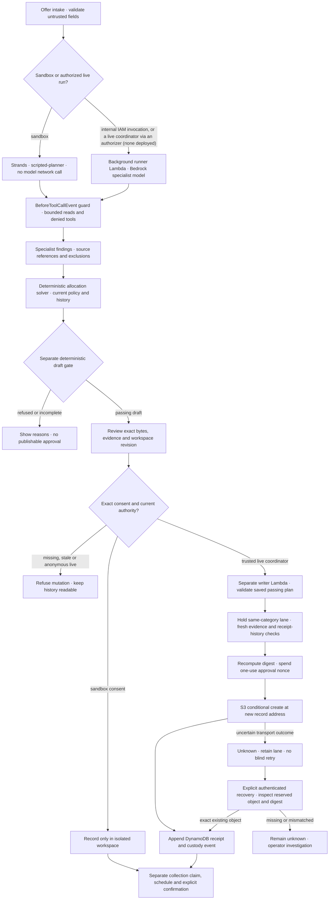

# Merismos: AWS execution and trust boundaries

For a community-food coordinator: [open Merismos](https://d2qnkmlhs7y5fp.cloudfront.net/),
choose + Add offer → Try success, edit the donation, choose Add to sandbox and review the exact plan.
The public sandbox uses real HTTP persistence and Strands with a scripted model, no model network
call or public publication. Live records are publicly read-only.

## Runtime, not a platform claim

Merismos runs on AWS Lambda (four functions from one package under three IAM roles), an Amazon API
Gateway HTTP API, Amazon DynamoDB, Amazon S3, Amazon CloudFront, Amazon Bedrock (live runs only),
Amazon EventBridge Scheduler with an Amazon SQS dead-letter queue for deferral wakes, AWS Secrets
Manager (a boundary canary the publish path never reads) and Amazon CloudWatch logs and alarms.
It does **not** run on AgentCore.
Strands Agents SDK is load-bearing in specialist tool dispatch and the BeforeToolCallEvent guard.
The deterministic gate is a separate control. The internal runner retains configured
`eu.anthropic.claude-opus-5`; a particular model call needs run evidence. Deploy applies supply
that evidence. Each apply of `deploy.yml` that is not a dry run makes two IAM-authorised runner
invocations, for offer-4471 and the refused offer-4477, and fails unless the offer-4471 run records
a specialist answer with source "model". The live proof in one deploy apply costs a median of
$1.62 (range $1.44 to $1.78), measured read-only over the five applies between 2026-09-09 and
2026-09-13 that called the model, at AWS Pricing API eu-west-1 on-demand prices and counting
Bedrock tokens and Lambda only. How that cost splits between the two runner invocations is not
measured, and the call and token counts in the README are per-column medians from different
proofs. CloudTrail attributes every Opus 5 call in those proof windows to the `merismos-reader`
role, which the runner runs under. The optional critic is a tool-less Bedrock call made in-process
by the reader-role function that runs the chore, not a separate Lambda. It is off by default:
`critic_model_id` defaults to empty and the deploy workflow does not set it.

## Governed agent and workflow flow

This follows `api.mutate`, `fleet.run_chore`, the Strands tool guard, `approval.authorise` and
`handler.publish`/`publication_status`. Lambda hosts execution; AgentCore is not deployed.

A refusal cannot be cleared by a model. Approval records an allocation; it does not prove collection.
The public sandbox keeps its simulated publications inside its durable workspace and does not call
the private writer. The authenticated live publication/recovery drill and human UAT remain NOT_RUN.
The evaluator Lambda is a separately provisioned role; `fleet.run_chore` executes the product's
deterministic draft gate without implying an evaluator Lambda call.
See the [architecture diagram](../README.md#architecture) for storage and IAM separation and the
[anonymous acceptance page](https://d2qnkmlhs7y5fp.cloudfront.net/acceptance.html) for release-bound evidence.

| Boundary | Authority and limit |
| --- | --- |
| Public reader / runner role | Corpus reads, bounded agent tools, ledger and workspace state, minting (not spending) approvals, `bedrock:InvokeModel`, `InvokeModelWithResponseStream` and `Converse` on any resource, EventBridge Scheduler create, get and delete in the wakes group, and Lambda invoke of the evaluator, writer and runner; no S3 PutObject. Public live changes would require a coordinator authorizer, and none is deployed. |
| Evaluator role | Draft-only gate, thread PutItem/GetItem for persisted custody and Query only on by-run for the legacy-head guard; no corpus reads or model authority. |
| Writer role | Approval GetItem/conditional UpdateItem; exact fresh passing draft; record conditional create (s3:PutObject on records/ and the private probes/ prefix); thread PutItem, GetItem and Query for receipts. Corpus reads/list only offers/, orgs/, registers/; corpus writes only offers/. Record reads (s3:GetObject on records/) carry no purpose condition in IAM; in code only exact-attempt recovery uses them. |
| Coordinator consent | Current workspace revision, run, evidence, bytes and address. A typed approved_by name is not authentication. |
| Custody | Event + persisted head conditional transaction for new runs. Headless pre-upgrade runs are read-only and require a fresh run. Old events remain unchanged; a digest is not source truth. |

The nonce is spent before S3 and receipt append follows S3. Therefore transport failure can leave
an unknown outcome. GET only projects saved state. Explicit authenticated recovery checks one
reserved approval against actual object metadata and bytes, then appends a missing receipt without
a second publication. Missing or mismatched objects require investigation; no blind retry.

New receipts use the network partition, category and recipient organisations. Readers also retain
legacy category partitions. Fairness uses the last two distinct same-category donations, not
corrections, and preserves the existing 40% cap. History without those fields remains unknown.
Approval binds that exact relevant history. The writer holds a same-category conditional lane
through the final fresh primary-table, strongly consistent history query and receipt append.
Unknown writes keep the lane reserved until exact-attempt recovery; there is no automatic expiry
that would permit a duplicate. Recovery needs the saved approval row, which carries a DynamoDB TTL
set one day after its 15-minute expiry. Once that row is gone, recovery refuses, and the held lane
keeps refusing new publications in that category until an operator investigates.
All history pages are read within a fail-closed bound, with category
filtering before the result cap so unrelated donations cannot hide the relevant history.

Record URLs are stable, and published records under records/ are publicly readable in a versioned
bucket with no expiry rule. Ledger entries and sandbox workspace items share the DynamoDB thread
table, which has point-in-time recovery and no TTL: a sandbox handle stops working after 24 hours,
but its item is not deleted automatically. Approval rows carry a TTL one day after their 15-minute
expiry. Lambda and API Gateway logs are kept 14 days, and the API access log records caller IP
addresses. Conditional creation prevents application overwrite but is not WORM;
external administrative changes and delete markers remain limits. No historical row or object is
automatically repaired. The known contradictory record remains disclosed in the README.

## Deployment and evidence

The source IAM change needs a Terraform dry run and a human plan review before an authorized apply,
to preserve resource identities and the current Opus 5 configuration. That review is a manual
procedure, not an enforced gate. `deploy.yml` runs only on manual dispatch and defaults to
`dry_run=yes`, which plans and stops. An apply dispatch makes a new plan and applies it with
`-auto-approve`, and its only automated plan check refuses a plan that adds more than 12 resources.
CI Terraform validation is not evidence of deployed-role behavior. The deploy proof uses genuine IAM internal worker
invocation for model execution; anonymous mutation probes assert 403 and public history stays
read-only. No new public authentication mechanism is simulated. The two CloudWatch alarms,
reader_errors (more than 5 reader errors in 5 minutes) and reader_volume (more than 500 reader
invocations in an hour), have no alarm actions, so they change state in CloudWatch and notify
nobody. `still-up.yml` fetches the API Gateway URL anonymously on Mondays and Thursdays at 09:00 UTC.
The old layer address is removed from management with `destroy = false`, while
`deps_retained` publishes the replacement with `skip_destroy = true`. The previously published
layer version is intended to remain unmanaged for rollback. A reviewed dry-run plan must show forgetting, not destroying,
the old version; only an authorized apply and subsequent read can establish the deployed result.

Evidence bundles show public sources, decisions, revision, run/provider/mode, failure/recovery and
handoff. Hashes do not prove food safety, delivery, compliance or savings. Time saved, human active
time and impact are unmeasured. Also not measured: cache tokens (no usage metric exists), cold-start
initialisation, DynamoDB, S3, CloudFront, EventBridge Scheduler, CloudWatch Logs and data-transfer
cost, GitHub Actions minutes, free tier, the actual invoice, and live-mode latency for the current
release (docs/live-run-2026-09-02.md records one earlier specialist read at its own dated
checkpoint). The only current latency figure is a sandbox HTTP sample from 2026-09-13 against
deployed commit cb97c9e: one workstation, 10 samples 15 s apart, a new TLS connection per request,
0 failures, and medians of 337 ms (POST /api/sessions), 317 ms (GET /api/workspace) and 426 ms
(scripted sandbox run). It is not a load test, render time or cold-start time. See the README and existing testbook for exact CI/AWS evidence,
NOT_RUN gaps, retained historical disclosures and dependency licences.

The acceptance publisher is separate from both browser jobs and uses only the existing frontend
release OIDC role. It writes sanitized receipts to the frontend bucket; it has no backend deploy,
record publication or model authority. The receipt takes the answering backend's commit from `GET /api/version`
observations of CI-packaged metadata before and after the journeys, and refuses to build if the two
differ. Without a known version it says unavailable. No frontend/backend parity is fabricated.
