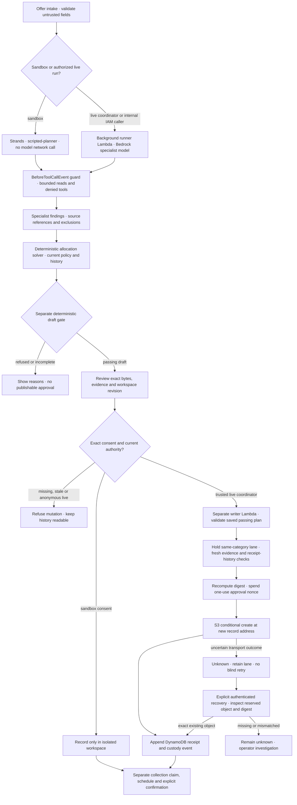

# Merismos — AWS execution and trust boundaries

For a community-food coordinator: [open Merismos](https://d2qnkmlhs7y5fp.cloudfront.net/),
choose Add an offer → Try success, edit the donation and review the exact plan.
The public sandbox uses real HTTP persistence and Strands with a scripted model, no model network
call or public publication. Live records are publicly read-only.

## Runtime, not a platform claim

Merismos runs on AWS Lambda, DynamoDB, S3 and CloudFront. It does **not** run on AgentCore.
Strands Agents SDK is load-bearing in specialist tool dispatch and the BeforeToolCallEvent guard.
The deterministic gate is a separate control. The internal runner retains configured
`eu.anthropic.claude-opus-5`; a particular model call needs run evidence. Optional tool-less
critic support does not establish a deployed or invoked critic Lambda.

## Governed agent and workflow flow

This follows `api.mutate`, `fleet.run_chore`, the Strands tool guard, `approval.authorise` and
`handler.publish`/`publication_status`. Lambda hosts execution; AgentCore is not deployed.

A refusal cannot be cleared by a model. Approval records an allocation; it does not prove collection.
The public sandbox keeps its simulated publications inside its durable workspace and does not call
the private writer. The authenticated live publication/recovery drill and human UAT remain NOT_RUN.
The evaluator Lambda is a separately provisioned role; `fleet.run_chore` executes the product's
deterministic draft gate without implying an evaluator Lambda call.
See the [architecture diagram](../README.md#architecture) for storage and IAM separation and the
[anonymous acceptance page](https://d2qnkmlhs7y5fp.cloudfront.net/acceptance.html) for release-bound evidence.

| Boundary | Authority and limit |
| --- | --- |
| Public reader / runner role | Corpus reads, bounded agent tools, ledger state and approved internal invocations; no S3 PutObject. Public live changes require a trusted coordinator authorizer. |
| Evaluator role | Draft-only gate, thread PutItem/GetItem for persisted custody and Query only on by-run for the legacy-head guard; no corpus reads or model authority. |
| Writer role | Approval GetItem/conditional UpdateItem; exact fresh passing draft; record conditional create. Corpus reads/list only offers/, orgs/, registers/; corpus writes only offers/. Record reads only for exact-attempt recovery. |
| Coordinator consent | Current workspace revision, run, evidence, bytes and address. A typed approved_by name is not authentication. |
| Custody | Event + persisted head conditional transaction for new runs. Headless pre-upgrade runs are read-only and require a fresh run. Old events remain unchanged; a digest is not source truth. |

The nonce is spent before S3 and receipt append follows S3. Therefore transport failure can leave
an unknown outcome. GET only projects saved state. Explicit authenticated recovery checks one
reserved approval against actual object metadata and bytes, then appends a missing receipt without
a second publication. Missing or mismatched objects require investigation; no blind retry.

New receipts use the network partition, category and recipient organisations. Readers also retain
legacy category partitions. Fairness uses the last two distinct same-category donations, not
corrections, and preserves the existing 40% cap. History without those fields remains unknown.
Approval binds that exact relevant history. The writer holds a same-category conditional lane
through the final fresh primary-table, strongly consistent history query and receipt append.
Unknown writes keep the lane reserved until exact-attempt recovery; there is no automatic expiry
that would permit a duplicate. All history pages are read within a fail-closed bound, with category
filtering before the result cap so unrelated donations cannot hide the relevant history.

Record URLs are stable. Conditional creation prevents application overwrite but is not WORM;
external administrative changes and delete markers remain limits. No historical row or object is
automatically repaired. The known contradictory record remains disclosed in the README.

## Deployment and evidence

The source IAM change needs a manual Terraform dry run and human plan review before authorized
apply, preserving resource identities and current Opus 5 configuration. CI Terraform validation is
not evidence of deployed-role behavior. The deploy proof uses genuine IAM internal worker
invocation for model execution; anonymous mutation probes assert 403 and public history stays
read-only. No new public authentication mechanism is simulated.
The old layer address is removed from management with `destroy = false`, while
`deps_retained` publishes the replacement with `skip_destroy = true`. Version 8 is intended
to remain unmanaged for rollback. A reviewed dry-run plan must show forgetting, not destroying,
the old version; only an authorized apply and subsequent read can establish the deployed result.

Evidence bundles show public sources, decisions, revision, run/provider/mode, failure/recovery and
handoff. Hashes do not prove food safety, delivery, compliance or savings. Time saved, human active
time and impact are unmeasured. See the README and existing testbook for exact CI/AWS evidence,
NOT_RUN gaps, retained historical disclosures and dependency licences.

The acceptance publisher is separate from both browser jobs and uses only the existing frontend
release OIDC role. It writes sanitized receipts to the frontend bucket; it has no backend deploy,
record publication or model authority. The receipt takes the backend commit from `GET /api/version`
observations of CI-packaged metadata before and after the journeys, and refuses to build if the two
differ. Without a known version it says unavailable. No frontend/backend parity is fabricated.
