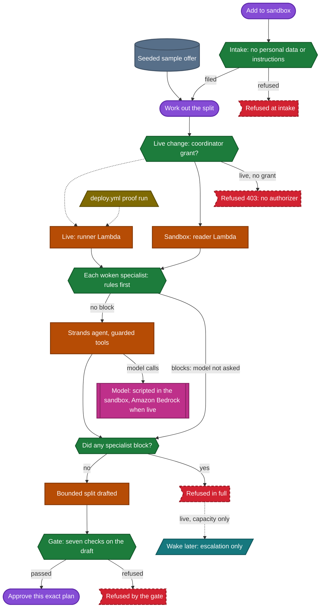
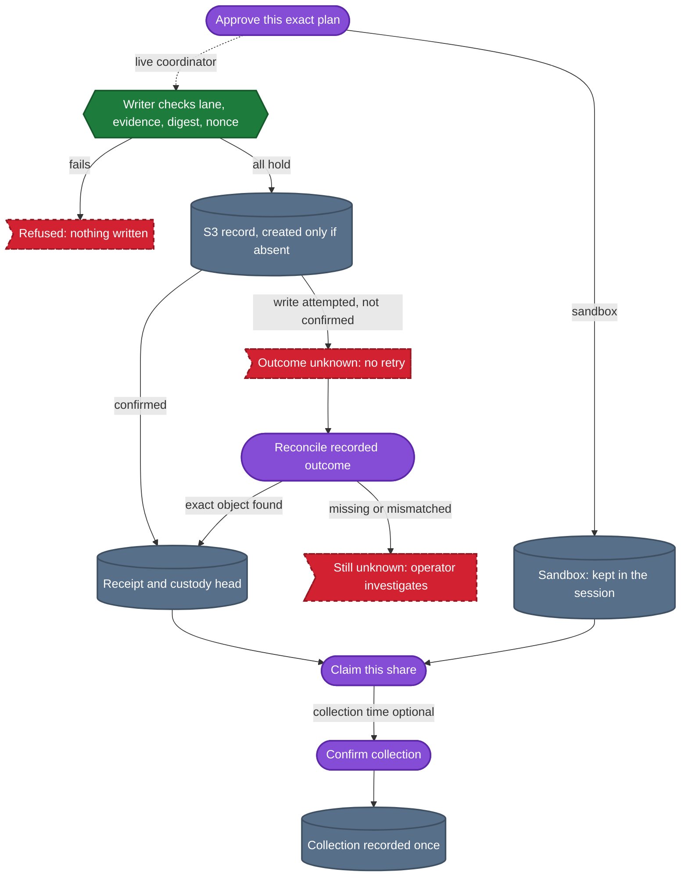

# Merismos: AWS execution and trust boundaries

For a volunteer food coordinator: [open Merismos](https://d2qnkmlhs7y5fp.cloudfront.net/). On the
**Dashboard** choose **Start with this offer →**, then **Work out the split**, tick the consent box and
choose **Approve in sandbox**. To try an invented donation, choose **+ Add offer → Try success**, edit the
fields, choose **Add to sandbox**, then **Work out the split**. The public sandbox saves each session
through the real HTTP API and runs Strands with a scripted model: no model network call and no public
publication. Live records are publicly read-only.

## What runs where

Merismos runs on:

- AWS Lambda: four functions from one package, under three fleet IAM roles, with a fourth role for EventBridge
  Scheduler.
- Amazon API Gateway (an HTTP API) and Amazon CloudFront.
- Amazon DynamoDB and Amazon S3.
- Amazon Bedrock, in live runs only.
- Amazon EventBridge Scheduler, with an Amazon SQS dead-letter queue for deferral wakes.
- AWS Secrets Manager, holding a boundary canary that the publish path never reads.
- Amazon CloudWatch logs and alarms.

It does not run on AgentCore. The Strands Agents SDK is load-bearing in specialist tool dispatch and the
`BeforeToolCallEvent` guard; the deterministic gate is a separate control. Every resource and IAM grant is listed
in [Infrastructure](infrastructure.md).

Terraform sets the model `eu.anthropic.claude-opus-5` on the two functions that run under the reader role, the
reader and the runner, and the `model` input of `deploy.yml` defaults to it. A configured model is not evidence
that a run called it; deploy applies supply that evidence. Each apply of `deploy.yml` that is not a dry run makes
two IAM-authorised runner invocations, for offer-4471 and the refused offer-4477, and fails unless the offer-4471
run records a specialist answer with source "model". The live proof in one deploy apply costs a median of $1.62
(range $1.44 to $1.78), counting Bedrock tokens and Lambda only. How it was measured, the per-column medians and
the CloudTrail attribution are in [Cost and latency](cost-and-latency.md#measured-cost-of-the-live-proof). The raw
cost rows are not in this repository.

The optional critic is a second Bedrock call with no tools, which reviews the prose about an allocation. The
reader-role function that runs the specialists makes it in-process; it is not a separate Lambda. It is off by
default: `critic_model_id` defaults to empty and the deploy workflow does not set it.

## Governed flow of one offer

This follows `api.mutate`, `fleet.run_chore`, the Strands tool guard, `approval.authorise` and
`handler.publish`/`publication_status`.

Both diagrams below share one key. Purple stadium: a person's act. Slate cylinder: data seeded or kept. Green
hexagon: a rule or check that can stop the run. Orange rectangle: code that runs. Magenta box with double
sides: the model, scripted in the sandbox and Amazon Bedrock in a live run. Teal parallelogram: a scheduled
wake. Olive trapezoid: GitHub Actions. Red flag with a dashed border: a refusal or a stop. A dotted arrow is
the live path. With no authorizer deployed, only the two deploy proof runs reach it: the offer-4471 run stops
at the approval card and the offer-4477 run at its refusal. The authenticated publication and recovery drill
is NOT_RUN.

### From an offer to an approved plan

### From approval to a recorded collection

In words, across both parts: each woken specialist runs its deterministic rules first, and a specialist whose
rules refuse is not sent to the model; the others still are. Any blocking specialist refuses the offer in full
before the solver runs, and only a changeable capacity block in a live run is parked with a one-shot wake,
which later appends an escalation and nothing else. Otherwise the solver drafts a bounded split and the draft
gate checks it. In the sandbox, approval records the decision in the isolated session. In a live run, approval
goes to the writer, which creates the record only if it is absent; an unknown outcome waits for an explicit
reconcile, and a missing or mismatched object stays unknown until an operator investigates. Claiming a share
and confirming collection are separate acts.

A refusal cannot be cleared by a model. Approval records an allocation; it does not prove collection. In the
public sandbox, approval publishes nothing and never calls the private writer. The authenticated live publication
and recovery drill and human acceptance testing (UAT) remain NOT_RUN. The evaluator Lambda runs under its own IAM
role. The product's deterministic draft gate runs in-process in `fleet.run_chore`; the reader invokes the
evaluator only to ask what AWS lets it do (`/identity?all=1`). See [Infrastructure](infrastructure.md) for storage and IAM separation and the
[anonymous acceptance page](https://d2qnkmlhs7y5fp.cloudfront.net/acceptance.html) for release-bound evidence.

### Donor CSV intake

Open **+ Add offer → Import a donor CSV instead**. The **CSV schema and sample** panel contains a copyable
UTF-8 sample. Required columns are `title,donor,quantity,unit,category,collection_date`; optional columns are
`use_by,allergens,allergens_unknown,hours_unrefrigerated,note`. Headers are case-sensitive, with no extra or
repeated columns. Files are limited to 65,536 bytes and 50 data rows. Preview writes nothing. Bad rows name
the failing field; exact duplicate intake facts in the file or current backend cannot be selected. Spreadsheet
formula-like cells are refused. Only explicitly selected valid rows are filed, one at a time through the
governed intake API. If an import stops, earlier confirmed rows remain; refresh and preview again before
retrying. Cancelling a preview discards its file and selection. Live intake still needs the authenticated
network-coordinator grant; CSV import adds no other way to authenticate.

### Collection disruption rehearsal

After a sandbox allocation, open **Rehearse a collection disruption**, choose the organisation affected, enter
a lower collection capacity in the offer's unit and choose **Record simulated disruption**.
**Recalculate the split** then shows the actual before and after recipients, exclusions and reasons. A
zero-capacity organisation receives nothing. Other safety, premises, transport and policy limits still apply.
The prior exact plan, run and receipt are retained; stale pickup commitments become invalid. The new plan
needs fresh exact consent before claim, schedule and confirmation. Confirmed collections cannot be
reallocated. Disruption is sandbox-only and changes no live source or historical public record.

## Trust boundaries

Each role is scoped in `infra/iam.tf`; every statement is listed in
[what each IAM role may do](infrastructure.md#iam-roles-and-what-each-may-do).

- **Reader role (reader and runner functions):** corpus reads and list; bounded agent tools; thread PutItem,
  GetItem and Query for ledger, custody and workspace items; approvals PutItem and GetItem, so it mints
  approvals but cannot spend one; `bedrock:InvokeModel`, `bedrock:InvokeModelWithResponseStream` and
  `bedrock:Converse` on any resource; EventBridge Scheduler create, get and delete in the wakes group, with
  `iam:PassRole` for the scheduler role only; Lambda invoke of the evaluator, writer and runner; no S3
  PutObject. No authorizer is deployed on the public API, so every public live change is refused with 403.
- **Evaluator role:** thread PutItem and GetItem for persisted custody and Query only on `by-run` for the
  legacy-head guard; no corpus reads or model authority. The product's draft gate runs in-process, and the
  reader invokes the evaluator only for `/identity?all=1`.
- **Writer role:** Approval GetItem/conditional UpdateItem; exact fresh passing draft; record conditional
  create (s3:PutObject on records/ and the private probes/ prefix); thread PutItem, GetItem and Query for
  receipts. Corpus reads/list only offers/, orgs/, registers/; corpus writes only offers/. Record reads
  (s3:GetObject on records/) carry no purpose condition in IAM; in code only exact-attempt recovery uses them.
  It can read the Secrets Manager boundary canary, which the publish path never reads.
- **Scheduler role:** trusted by EventBridge Scheduler in this account; it may invoke only the runner and send
  to the wake dead-letter queue.
- **Coordinator consent:** binds the current workspace revision, run, evidence, record bytes and address. A typed
  `approved_by` name is not authentication. This repository does not provide a public sign-in integration. Without
  one, use the sandbox and read the live history.
- **Custody:** each new custody event and its run's persisted head are written in one conditional transaction.
  Runs recorded before persisted heads existed are read-only and need a fresh run. Old events are never rewritten,
  and a digest does not prove the source is true.
- **GitHub deploy role, outside Terraform:** it also has `s3:*` on the Merismos buckets and `secretsmanager:*`
  on the canary, so it can put a record and read the canary too; among the fleet roles only the writer can put
  a record.

## Publication and recovery boundaries

### Approval and the writer

Every approval route uses the same trusted identity, current passing plan, relevant-source digest, workspace
revision and exact consent. Gate-refused drafts remain historically readable but never become publishable
merely because they contain a draft body. Legacy cards are read-only.

The separate writer checks the saved verdict and current evidence, recomputes the approval digest, spends a
short-lived single-use nonce and creates the record with `IfNoneMatch: *`. Corrections use `offer-<id>-c2.md`,
then the next version. Existing URLs and bytes are not repaired, renamed or overwritten. Receipts written now
share the network partition and include category and recipient organisations; the history reader also reads the
older category partitions without rewriting them.

An intake correction, such as **Try correction** in the sandbox, is different from a publication correction,
which creates the next record address after another review.

### Unknown outcomes and recovery

The nonce is spent before S3 and receipt append follows S3, so a transport failure can leave an unknown
outcome. A timeout after spending a nonce is an **unknown outcome**, not permission to publish again. The
approval also binds the last-two same-category receipt history used for fairness. The writer holds a
conditional same-category lane while strongly reading primary-table receipt history, checking freshness,
creating the object and appending its receipt. An unknown write keeps that lane until recovery proves what
happened; no lock expires on its own, so waiting cannot authorize a duplicate. Refresh only reads. An
authenticated coordinator explicitly reconciles one reserved attempt with `POST /api/offers/<id>/recover`: it
checks the actual saved object's nonce and digest and can append a missing receipt, but cannot publish again.
Missing or mismatched bytes remain unknown. Known pre-write failures allow a reviewed new request. No automatic
retry spends a second approval. Recovery needs the saved approval row, which carries a DynamoDB time-to-live (TTL)
set one day after its 15-minute expiry. Once that row is gone, recovery refuses, and the held lane keeps refusing
new publications in that category until an operator investigates.

### Custody and hashes

New custody events advance a persisted per-run head atomically with a conditional transaction. Competing
appends retry only rejected transactions; uncertain transport failures do not retry blindly. Old entries are
not restamped or reparented. If a run recorded before persisted heads existed has events but no head, it is
read-only and needs a fresh run. A hash verifies byte relationships, not source truth, food safety, delivery or
compliance. Conditional creation is not write-once (WORM) storage: administrative deletion, delete markers,
external writes and storage policy remain limitations. See
[Amazon S3 conditional-write semantics](https://docs.aws.amazon.com/AmazonS3/latest/userguide/conditional-writes.html).

### Longitudinal fairness

Longitudinal fairness consumes actual saved receipts for the last two distinct donations in the same category.
Corrections are not extra donations and another category does not affect that history. The policy's 40%
per-offer cap still applies, and unknown historical category or recipient fields are never filled in. Allocation
is a bounded deterministic solver, not an optimality claim. All history pages are read within a fail-closed
bound, with category filtering before the result cap so unrelated donations cannot hide the relevant history.

## What is kept, and for how long

Record URLs are stable, and published records under records/ are publicly readable in a versioned bucket with
no expiry rule. Ledger entries and sandbox workspace items share the DynamoDB thread table, which has
point-in-time recovery and no TTL: a sandbox session stops working after 24 hours, but its item is not deleted
automatically. Approval rows carry a TTL one day after their 15-minute expiry. Lambda and API Gateway logs are
kept 14 days, and the API access log records caller IP addresses. Conditional creation prevents application
overwrite but is not WORM; external administrative changes and delete markers remain limits. No historical row
or object is automatically repaired. The known contradictory offer-4471 record remains disclosed in
`README.md` and in [Evidence and honest limits](evidence.md#historical-records); it is not repaired.

## Where the evidence is

A person should read the Terraform plan of any change under `infra/` before an apply; that review is a manual
procedure, not an enforced gate (see [Backend deploy](release-and-validation.md#backend-deploy)). CI Terraform
validation is not evidence of deployed-role behavior. The deploy proof uses genuine IAM internal worker invocation
for model execution; anonymous mutation probes assert 403 and public history stays read-only. No public
authentication is simulated. The alarms and the scheduled reachability check, and what they do not watch, are in
[Observability](infrastructure.md#observability).

Evidence bundles show public sources, decisions, revision, run/provider/mode, failure/recovery and handoff.
Hashes do not prove food safety, delivery, compliance or savings. Time saved, human active time and impact are
unmeasured; the costs, latency and tests that are not measured or not run are listed in
[Not measured and not run](evidence.md#not-measured-and-not-run), and
[live-run-2026-09-02.md](live-run-2026-09-02.md) records one earlier specialist read at its own dated
checkpoint. The only latency figure is a sandbox HTTP sample from 2026-09-13, taken when the deployed
frontend and backend were both at commit `cb97c9e`; see
[Cost and latency](cost-and-latency.md#sandbox-latency-sample). NOT_RUN cases are listed in the
[acceptance testbook](../frontend/UAT.testbook.html). The
[README](../README.md#pre-existing-components-and-licences) covers retained historical disclosures and
dependency licences.

The acceptance publisher, and how its receipt identifies the answering backend, are in
[Current public acceptance](evidence.md#current-public-acceptance).
