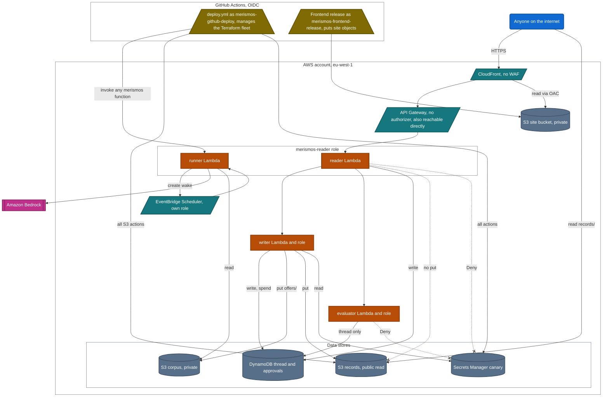

# Infrastructure

Everything regional is in `eu-west-1` (`infra/variables.tf:10`, `infra/main.tf:29`, `infra/frontend.json:5`); CloudFront is global. Terraform in `infra/*.tf` declares the backend. `infra/frontend_stack.py` renders a separate CloudFormation stack for the site, and `infra/bootstrap.sh` creates the Terraform state bucket and the GitHub deploy role. Names below are patterns: a fresh apply gets new random suffixes (`infra/main.tf:49-51`). This page describes what the repository declares, not what an account holds today.

The diagram shows identities and the grants between them, not every resource; the tables after it list every resource. The request flow is in the [README overview](../README.md#architecture) and the [governed flow of one offer](architecture.md#governed-flow-of-one-offer).

Each grey box is a boundary: the `merismos-reader role` box holds the two Lambdas that share that role, every other Lambda runs as the role of its own name, and the GitHub jobs assume their roles through OIDC. Blue rounded box: anyone. Teal parallelogram: an entry point or service. Orange rectangle: a Lambda function. Slate cylinder: a data store. Magenta box with double sides: the external model service. Olive trapezoid: a GitHub Actions job. A labelled solid arrow is the access its label names. An unlabelled solid arrow is a request or an invoke: CloudFront to its API origin, API Gateway to the reader, one Lambda to another or to Bedrock, and the release job's put named on its box. A dotted arrow ending in a cross is an explicit Deny or a missing Allow. A grant drawn from one reader-role Lambda holds for both. Not drawn, because none exists: a VPC, a NAT gateway, an alarm action or a customer-managed key.

In words: anyone reaches CloudFront, which serves the site from a private bucket and passes API paths to API Gateway; anyone can also call API Gateway directly, and it has no authorizer. API Gateway invokes the reader. The reader and runner functions share the `merismos-reader` role, which may call Bedrock, create wakes and invoke the other functions, but may not put a record or read the canary. Among the three fleet roles only the writer puts records, and anyone may read a published record. The scheduler role may invoke only the runner and send to the wake dead-letter queue. Outside the fleet, the GitHub deploy role has all S3 actions on the Merismos buckets, all Secrets Manager actions on the canary and every Lambda action on the Merismos functions; the frontend release role only reads, lists and puts site objects, invalidates the distribution and describes its own stack.

## Resources by concern

### Edge and hosting

CloudFormation stack `merismos-frontend`, parameters in `infra/frontend.json:2-6`. No workflow or script in the repository creates or updates the stack; `.github/workflows/frontend-deploy.yml:46` refuses to release until it exists, and `.github/workflows/aws-hosting-ci.yml:34` only renders the template.

| Resource | Name pattern | What it does | Source |
| --- | --- | --- | --- |
| S3 site bucket | `merismos-web-<account>-<region>` | Private, versioned, AES256 server-side encryption, all public access blocked, retained if the stack is deleted | `infra/frontend_stack.py:58-74` |
| Bucket policy | n/a | Only this distribution may read (`OnlyOurCloudFrontReads`); plain HTTP is denied (`DenyPlainHttp`) | `infra/frontend_stack.py:144-158` |
| Origin access control | `merismos-web-<account>` | Signs CloudFront requests to the site bucket | `infra/frontend_stack.py:75-82` |
| CloudFront Function | `merismos-web-router-<account>` | Rewrites application paths to `/index.html`; API paths and missing assets stay errors | `infra/frontend_stack.py:15-23`, `:83-90` |
| Response headers policy | `merismos-web-headers-<account>` | nosniff, frame DENY, no-referrer, HSTS, a same-origin content security policy | `infra/frontend_stack.py:91-109` |
| CloudFront distribution | live host `d2qnkmlhs7y5fp.cloudfront.net` (`.github/workflows/aws-uat.yml:32`) | HTTPS only, default certificate; `/api/*`, `/api`, `/healthz`, `/offer/*`, `/config` and `/identity` go to the API Gateway origin uncached; `/assets/*` is cached; everything else comes from the site bucket uncached | `infra/frontend_stack.py:11-13`, `:43-56`, `:110-143` |
| Release role | `merismos-frontend-release` | See [the release role](#merismos-frontend-release-cloudformation) | `infra/frontend_stack.py:159-187` |

Objects written by CI, not by the stack: release files under `releases/<sha>/` plus root copies, `assets/*` cached for a year, everything else `no-store`, then an invalidation of `/`, `/index.html` and `/release.json` (`infra/frontend_publish.py:81-96`); acceptance receipts `acceptance/runs/<run>-<attempt>.json`, created only if absent, and `acceptance.json` (`infra/acceptance_receipt.py:177`, `:199-210`).

### API

| Terraform address | Name | What it does | Source |
| --- | --- | --- | --- |
| `aws_apigatewayv2_api.judge` | `merismos-judge` | HTTP API; CORS `*` for GET and POST | `infra/gateway.tf:28-39` |
| `aws_apigatewayv2_integration.reader` | n/a | Proxies to the reader, payload 2.0, 30 second timeout | `infra/gateway.tf:41-50` |
| `aws_apigatewayv2_route.everything`, `aws_apigatewayv2_route.root` | `ANY /{proxy+}`, `ANY /` | No authorization type and no authorizer | `infra/gateway.tf:52-62` |
| `aws_apigatewayv2_stage.live` | the default stage | Auto deploy; throttle 10 requests per second, burst 20; JSON access log including the caller IP | `infra/gateway.tf:69-95`; `infra/variables.tf:70`, `:76` |
| `aws_lambda_permission.gateway_may_invoke_the_reader` | `AllowJudgeGateway` | API Gateway may invoke the reader | `infra/gateway.tf:97-103` |
| `aws_lambda_function_url.reader`, `aws_lambda_permission.reader_answers_anyone` | reader Function URL | Auth type NONE with a public invoke permission. Public Function URLs were refused at account level at the 2026-09-02 checkpoint, which is why the HTTP API exists; not the public path | `infra/main.tf:198-221`; `infra/gateway.tf:4-12` |
| `aws_lambda_function_url.private` (2) | evaluator and writer Function URLs | Auth type AWS_IAM | `infra/main.tf:223-227` |

The live API host is `efnt6e0kv7.execute-api.eu-west-1.amazonaws.com` (`infra/frontend.json:6`, `.github/workflows/still-up.yml:37`). It answers directly as well as through CloudFront: nothing restricts it to CloudFront (`infra/frontend_stack.py:123-126`). The runner has no Function URL (`infra/main.tf:198-227`).

### Compute

One `aws_lambda_function.fleet` resource with `for_each` over four deployments (`infra/main.tf:75-76`; `infra/iam.tf:54-59`): handler `merismos.handler.handler`, runtime `python3.13`, one zip (`infra/main.tf:61-67`, `:78-83`), layer `merismos-deps` (`infra/main.tf:97`, `:176-188`).

| Function | IAM role | Timeout | Memory | Reserved concurrency | Function URL |
| --- | --- | --- | --- | --- | --- |
| `merismos-reader` | reader | 60 s | 1024 MB | 5 | NONE |
| `merismos-runner` | reader | 900 s | 1024 MB | 4 | none |
| `merismos-evaluator` | evaluator | 30 s | 512 MB | unreserved | AWS_IAM |
| `merismos-writer` | writer | 30 s | 512 MB | unreserved | AWS_IAM |

Sources: timeout keys on the function name (`infra/main.tf:94`), memory on the role (`:95`, so the runner gets 1024 MB), reserved concurrency (`:108-111`; defaults `infra/variables.tf:95`, `:110`), Function URLs (`infra/main.tf:198-227`). The reader's asynchronous invokes are never retried (`infra/gateway.tf:113-116`). Environment: `MERISMOS_MODEL` is the model id for the two reader-role functions and `none` for the others (`infra/main.tf:152`); `MERISMOS_CRITIC_MODEL` is empty by default (`:153`; `infra/variables.tf:36`); the reader finds the writer and the runner by name (`infra/main.tf:128`, `:131`); the wake target, scheduler role, group and dead-letter queue are passed in (`:155-158`). The layer is built with `strands-agents>=1.53.0` and `boto3>=1.40`, then boto3 and botocore are removed so the runtime copy is used (`infra/build.sh:20-32`); the old layer address is forgotten with `destroy = false` and the new one is kept on destroy (`infra/main.tf:169-177`).

### Data

| Terraform address | Name pattern | What it holds and how | Source |
| --- | --- | --- | --- |
| `aws_dynamodb_table.thread` | `merismos-thread` | Ledger events, custody heads (a two-item transaction) and workspace sessions, in separate partitions; on-demand; key `subject` and `entry_id`; indexes `by-run` and `by-kind`; point-in-time recovery; no TTL | `infra/main.tf:233-273`; `src/merismos/ledger.py:300-336`; `src/merismos/workspace_store.py:3-5` |
| `aws_dynamodb_table.approvals` | `merismos-approvals` | One-use approvals, with `ttl` one day after expiry, and same-category lanes; on-demand; key `nonce`; point-in-time recovery | `infra/main.tf:275-296`; `src/merismos/approval.py:227`, `:270-291` |
| `aws_s3_bucket.corpus` with public access block and versioning | `merismos-corpus-<hex>` | The network's filing: private, versioned, emptied on destroy while `destroyable` is true; the writer files typed offers under `offers/` | `infra/main.tf:303-321`; `infra/variables.tf:59`; `src/merismos/handler.py:660-673` |
| `aws_s3_object.corpus` | 14 objects | Seeds `corpus/**`: 3 offers, 3 manifests, 5 organisations, 3 registers | `infra/main.tf:382-389` |
| `aws_s3_bucket.records` with public access block, bucket policy and versioning | `merismos-records-<hex>` (live `merismos-records-e6ac6047`, `.github/workflows/still-up.yml:83`) | Published records `records/offer-<n>[-cN].md`, created only if absent; anyone may `s3:GetObject` on `records/*` and nothing else; versioned; no lifecycle rule | `infra/main.tf:325-377`; `src/merismos/handler.py:490`, `:543-548` |
| `aws_secretsmanager_secret.publish` with a version | `merismos/publish-<hex>` | A boundary canary that the publish path never reads; recovery window 0 days | `infra/main.tf:395-423`; `infra/iam.tf:9-13` |

Sandbox runs keep their events inside the workspace item, not as ledger rows (`src/merismos/api.py:529-537`). `/identity` writes zero-byte `probes/identity-<role>` objects, outside the public prefix (`src/merismos/handler.py:309-311`).

### Scheduling

| Terraform address | Name | What it does | Source |
| --- | --- | --- | --- |
| `aws_scheduler_schedule_group.wakes` | `merismos-wakes` | Holds the one-shot schedules that application code creates | `infra/main.tf:429-431` |
| `aws_sqs_queue.wake_dlq` | `merismos-wake-dlq` | Dead-letter queue for wakes, 14-day retention | `infra/main.tf:433-436` |
| `aws_lambda_permission.scheduler_may_wake_the_reader` | `AllowSchedulerInvoke` | EventBridge Scheduler may invoke `merismos-runner` (the address says reader; the target is the runner) | `infra/main.tf:438-444` |
| `aws_iam_role.scheduler` | `merismos-scheduler` | See [the scheduler role](#merismos-scheduler) | `infra/iam.tf:324-363` |

Schedules are named `merismos-wake-<id>`, fire once, delete themselves, retry 3 times within an hour and send failures to the queue (`src/merismos/deferral.py:168-213`). The runner creates them during a live run (`src/merismos/handler.py:1196-1202`; `src/merismos/fleet.py:976`). A wake only appends an escalation: no model, no writer, no approval (`src/merismos/handler.py:158-159`, `:777-798`). Sandbox runs pass no scheduler (`src/merismos/api.py:534-535`; `src/merismos/fleet.py:715`).

### Observability

| Terraform address | Name | What it does | Source |
| --- | --- | --- | --- |
| `aws_cloudwatch_log_group.fleet` (4) | `/aws/lambda/merismos-reader`, `-runner`, `-evaluator`, `-writer` | 14-day retention | `infra/main.tf:69-73`; `infra/variables.tf:48` |
| `aws_cloudwatch_log_group.gateway` | `/aws/apigateway/merismos-judge` | 14-day retention | `infra/gateway.tf:64-67` |
| `aws_cloudwatch_metric_alarm.reader_errors` | `merismos-reader-errors` | More than 5 reader errors in 300 seconds; no alarm action | `infra/gateway.tf:118-130` |
| `aws_cloudwatch_metric_alarm.reader_volume` | `merismos-reader-unexpected-volume` | More than 500 reader invocations in 3,600 seconds; no alarm action | `infra/gateway.tf:132-144`; `infra/variables.tf:85` |

No alarm watches the runner, evaluator, writer, API stage or dead-letter queue (`infra/gateway.tf:118-144` are the only alarms). `still-up.yml` checks the API Gateway host and one record URL anonymously on Mondays and Thursdays at 09:00 UTC (`.github/workflows/still-up.yml:23`, `:37`, `:83`); nothing on a schedule checks the CloudFront URL.

### Resource count

Terraform declares 65 instances: 51 plus the 14 corpus objects. `deploy.yml` says "This stack is 51 resources" and fails any plan that adds more than 12 (`.github/workflows/deploy.yml:83-90`). The frontend stack adds 7 CloudFormation resources (`infra/frontend_stack.py:57-188`). The [dated deployment record](deploy-2026-09-02.md) counted 61 at its own checkpoint.

## IAM roles and what each may do

### `merismos-reader`: the reader and runner functions

Role keys at `infra/iam.tf:54-59`, policy at `:96-170`.

- `ReadTheFiling`: S3 GetObject and ListBucket on the corpus bucket (`:99-103`).
- `AppendToTheThread`: DynamoDB PutItem, GetItem and Query on the thread table and its indexes (`:109-113`).
- `MintAnApproval`: PutItem and GetItem on the approvals table, so it mints an approval but cannot spend one (`:117-121`).
- `AskTheModels`: `bedrock:InvokeModel`, `bedrock:InvokeModelWithResponseStream` and `bedrock:Converse` on any resource, because inference profiles resolve across regions (`:123-127`). The public sandbox still calls no model; that rests on the code path (`src/merismos/api.py:534`), not on IAM.
- `AskTheOtherTwoAndTheRunner`: Lambda invoke of the evaluator, writer and runner (`:142-150`).
- `ScheduleAWake`: Scheduler create, get and delete in `merismos-wakes` (`:154-158`).
- `LetTheSchedulerAssumeItsOwnRole`: `iam:PassRole` for `merismos-scheduler`, only to the Scheduler service (`:160-169`).
- An explicit Deny on reading the canary (`:300-314`), and no S3 PutObject statement (`:96-170`).
- Logs only to `/aws/lambda/merismos-reader:*`; no statement names the runner's log group (`:75-90`, role keys at `:42`). Whether runner logs arrive was not checked.

### `merismos-evaluator`

Policy at `infra/iam.tf:180-191`.

- `RecordTheVerdict`: PutItem and GetItem on the thread table (`:181-185`).
- `DetectReadOnlyLegacyRuns`: Query on `index/by-run` (`:186-190`).
- An explicit Deny on reading the canary (`:309-314`). No S3, Bedrock or Lambda statement.
- Only `/identity?all=1` invokes this function (`src/merismos/handler.py:331-373`); the product's draft gate runs in-process (`src/merismos/fleet.py:796`).

### `merismos-writer`

Policy at `infra/iam.tf:197-276`.

- `ReadTheBoundaryCanary`: GetSecretValue on the canary (`:203-206`), used only by the identity probe (`src/merismos/handler.py:376-387`).
- `SpendTheApproval`: GetItem and UpdateItem on the approvals table (`:210-214`).
- `RecordThePublish`: PutItem, GetItem and Query on the thread table and indexes (`:216-220`).
- `ListApprovalEvidence`: ListBucket on the corpus for `offers/*`, `orgs/*` and `registers/*` (`:222-231`).
- `ReadApprovalEvidence`: GetObject on those prefixes (`:233-241`).
- `ReconcileExactPublication`: GetObject on `records/*` (`:243-247`), used only by recovery (`src/merismos/handler.py:597`).
- `PublishTheRecord`: PutObject on `records/*` and `probes/*` (`:257-264`). Among the three fleet roles, only the writer holds it.
- `FileAnOfferAPersonTyped`: PutObject on corpus `offers/*` (`:271-275`).

### `merismos-scheduler`

Trusted by the Scheduler service for this account only (`infra/iam.tf:324-337`); may invoke `merismos-runner` (`:349-352`) and send to `merismos-wake-dlq` (`:353-356`).

### `merismos-github-deploy`, outside Terraform

Created by `infra/bootstrap.sh:30`, `:130-142`, and trusted by GitHub OIDC for the `aws` environment of this repository and owner (`:109-127`). Its inline policy `manage-the-fleet` (`:153-269`) has `KeepTheState` (`:158`), `TheFleetsOwnBuckets` with `s3:*` on `merismos-*` buckets, so it can also write records (`:164`), `ListBucketsToPlan` (`:170`), `TheFunctionsAndTheirLayer` with `lambda:*` (`:176`), `LambdaAccountReadsThatTakeNoResource` (`:186`), `TheBoundaryItself` for `merismos-*` roles and policies (`:192`), `TheThreadAndTheApprovals` (`:205`), `TheJudgesDoor` for API Gateway (`:211`), `TheWakes` (`:217`), `ListSchedulerToPlan` (`:226`), `TheDeadLetterQueue` (`:232`), `ListQueuesToProve` (`:238`), `TheBoundaryCanary` with `secretsmanager:*` (`:244`), `TheLogsAndTheAlarms` (`:250`) and `WhoAmI` (`:256`). It has no Bedrock, CloudFront or CloudFormation statement. `deploy.yml` assumes it (`.github/workflows/deploy.yml:37`, `:48-51`) and uses it to invoke the runner for the live proof (`:220-224`, `:307-311`).

### `merismos-frontend-release`, CloudFormation

Defined at `infra/frontend_stack.py:159-187` and trusted by GitHub OIDC for `refs/heads/main` only, with one-hour sessions (`:162-172`). Its policy `release-own-frontend-only` allows Get, GetVersion and Put on site objects, List and ListVersions on the site bucket, Create and Get invalidations on this distribution, and DescribeStacks on its own stack (`:174-185`). No delete, backend, records or model permission. Used by `.github/workflows/frontend-deploy.yml:55-58` and the acceptance publisher (`.github/workflows/aws-uat.yml:106-139`).

Jobs with no AWS credentials: `still-up.yml` (`:27`, `:39-40`), the acceptance and proof-browser jobs in `aws-uat.yml` (`:25-26`, `:144-145`), the `ci.yml` test job with empty keys (`:87-92`), and `frontend-ci.yml` verify with fake keys (`:57-65`).

## What lives outside Terraform

1. The Terraform state bucket `merismos-tfstate-e6ac6047`: versioned, public access blocked, AES256; the backend has no lock (`infra/bootstrap.sh:29`, `:43-65`; `infra/main.tf:18-31`).
2. The deploy role `merismos-github-deploy` and its policy `manage-the-fleet` (`infra/bootstrap.sh:30`, `:130-142`, `:266-269`).
3. The GitHub OIDC provider, which already existed in the account; its creator is not in the repository (`infra/bootstrap.sh:68-69`).
4. The CloudFormation stack `merismos-frontend`: site bucket (retained on deletion), origin access control, router function, headers policy, distribution, bucket policy and release role (`infra/frontend_stack.py:57-188`). How the stack was first deployed is not in the repository.
5. GitHub configuration: the `aws` environment with secret `AWS_DEPLOY_ROLE_ARN` (`infra/bootstrap.sh:276-281`; `.github/workflows/deploy.yml:37`, `:50`), the variable `FRONTEND_RELEASE_ROLE_ARN` (`.github/workflows/frontend-deploy.yml:43`, `:57`), and the variables `MERISMOS_EVAL_GRANT_JSON` and `MERISMOS_EVAL_GRANT_SHA256` (`.github/workflows/ci.yml:165`, `:177-178`).
6. Objects created at runtime: EventBridge schedules (`src/merismos/deferral.py:196-213`), records and probe objects, filed offers, frontend releases and acceptance receipts.
7. What survives a destroy: layer versions (`infra/main.tf:169-177`), the site bucket (`infra/frontend_stack.py:59-60`), the state bucket and the deploy role (`.github/workflows/deploy.yml:379-389`). The teardown's leftover check lists Lambda functions, DynamoDB tables, S3 buckets, IAM roles, SQS queues and Scheduler groups whose names start with `merismos` (`.github/workflows/deploy.yml:390-395`) and leaves out only the state bucket and the deploy role (`:385`). It does not list API Gateway, log groups, alarms, the Secrets Manager canary or layer versions. The frontend stack's site bucket (`merismos-web-<account>-<region>`, `infra/frontend_stack.py:62`) and release role (`merismos-frontend-release`, `:162`) are outside Terraform but match the listing, so while that stack exists a run with `keep=no` fails with "teardown left resources behind" (`.github/workflows/deploy.yml:404-409`).

## What is not deployed

| Not deployed | What the repository shows | Evidence |
| --- | --- | --- |
| VPC | The functions set no `vpc_config`; no VPC, subnet or endpoint resource exists, so there is no hourly networking charge | `infra/main.tf:75-163`; resource lists in `infra/main.tf`, `infra/gateway.tf`, `infra/iam.tf` |
| NAT gateway | None declared | same resource lists |
| API authorizer | No authorizer resource, and the routes set no authorization type. The code needs an authorizer context with `merismos:coordinate` for live changes, so every public live change gets 403 | `infra/gateway.tf:52-62`; `src/merismos/api.py:140-147`, `:347-348`; `.github/workflows/deploy.yml:276-300` |
| Web application firewall | No web ACL on the distribution and no WAF resource | `infra/frontend_stack.py:113-139` |
| Alarm notification | Neither alarm sets `alarm_actions` or `ok_actions`; no SNS topic | `infra/gateway.tf:118-144` |
| Customer-managed encryption keys | None. The site and state buckets declare AES256; the corpus and records buckets, both tables, the secret, the queue and the log groups declare no encryption setting, so the AWS default applies | `infra/frontend_stack.py:69-71`; `infra/bootstrap.sh:62-65`; `infra/main.tf:69-73`, `:233-296`, `:303-377`, `:395-412`, `:433-436`; `infra/gateway.tf:64-67` |
| Tracing | No `tracing_config` | `infra/main.tf:75-163` |
| Lambda dead-letter queue or failure destination | None on any function; the only event invoke configuration is the reader's zero retries | `infra/main.tf:75-163`; `infra/gateway.tf:113-116` |
| CPU architecture setting | No `architectures` argument, so the AWS default (x86_64) applies | `infra/main.tf:75-163` |
| Custom domain | Default CloudFront certificate, no aliases | `infra/frontend_stack.py:118` |
| CloudFront access logging | No logging configuration | `infra/frontend_stack.py:113-139` |
| S3 lifecycle rules or write-once retention | None declared | `infra/main.tf:303-377` |
| Thread table TTL | None, so sandbox session items are not deleted automatically | `infra/main.tf:233-273` |
| CloudTrail trail | None declared | `infra/*.tf` |
| AgentCore | Not deployed; nothing in `src/`, `infra/` or `.github/` names it | `git grep -i agentcore` |
