# Release and validation

Every release check runs in GitHub Actions on the exact source under review. A pull request deploys
nothing; a push to `main` publishes the frontend; the backend changes only when someone dispatches
`deploy.yml` by hand.

```mermaid
flowchart TB
    accTitle: Merismos delivery pipeline
    accDescr: Pull requests run source checks. A push to main verifies and publishes the frontend, then runs live acceptance. A manual backend dispatch plans first, applies only when dry run is disabled, proves the deployment and can tear it down.

    subgraph Every["Pull request, or push to a CI branch"]
        Pr("Open a pull request or push"):::human
        Checks["CI and Frontend verification"]:::cicd
    end
    subgraph Frontend["Merge to main: frontend"]
        Merge("Merge to main"):::human
        Verify{"Frontend verification again"}:::gate
        Preflight{"Backend preflight"}:::gate
        Guard{"Main still at this commit"}:::gate
        Publish["Publish: HTML last"]:::store
        Smoke{"Smoke test"}:::gate
        Testbook{"Live Playwright testbook"}:::gate
        Receipt["Acceptance receipt published"]:::store
        ProofRead{"Proof page read anonymously"}:::gate
    end
    subgraph Backend["Manual dispatch: backend"]
        Dispatch("Dispatch deploy.yml"):::human
        Plan{"Plan: at most 12 additions"}:::gate
        DryRun["Stopped: dry run, plan kept"]:::refused
        Apply["Terraform apply"]:::cicd
        Proofs{"IAM and model proofs"}:::gate
        Teardown["Destroy, list leftovers"]:::cicd
    end

    Pr --> Checks
    Pr ---> Merge
    Merge --> Verify
    Verify --> Preflight
    Preflight --> Guard
    Guard --> Publish
    Publish --> Smoke
    Smoke --> Testbook
    Testbook --> Receipt
    Receipt --> ProofRead
    Dispatch --> Plan
    Plan -->|"dry run yes"| DryRun
    Plan -->|"dry run no"| Apply
    Apply --> Proofs
    Proofs -->|"keep no, pass or fail"| Teardown
    Apply -.->|"new backend at /api/version"| Preflight
    ProofRead ~~~ Dispatch

    style Every fill:none,stroke:#6e7781,stroke-width:1px
    style Frontend fill:none,stroke:#6e7781,stroke-width:1px
    style Backend fill:none,stroke:#6e7781,stroke-width:1px
    classDef human fill:#854cd5,stroke:#5d28a9,stroke-width:2px,color:#ffffff
    classDef gate fill:#1d7c3c,stroke:#15592b,stroke-width:2px,color:#ffffff
    classDef store fill:#576f89,stroke:#3f5063,stroke-width:2px,color:#ffffff
    classDef cicd fill:#7f6a03,stroke:#5b4c02,stroke-width:2px,color:#ffffff
    classDef refused fill:#d22231,stroke:#971823,stroke-width:2px,color:#ffffff
```

Purple rounded node: a person's act. Olive rectangle: a workflow step that runs. Green diamond: a check that
stops the pipeline when it fails. Slate rectangle: what gets published. Red rectangle: a stop. The dotted
arrow couples the two pipelines: a new backend at `/api/version` is what lets a frontend
release that changed runtime paths pass its preflight, on the next push to `main` or a manual dispatch of
the frontend release.

In words: a pull request runs CI and Frontend verification, plus the AWS hosting contract and Docs
verification when their files change. A push to `main` runs Frontend verification again, checks that the
backend answering `/api/version` matches the runtime source, confirms that `main` has not moved,
publishes the site, smoke tests it, runs the live Playwright testbook against AWS, publishes an
acceptance receipt and reads the public proof page without credentials. The backend deploys only when
someone dispatches `deploy.yml` by hand, and it defaults to a dry run. Twice a week, `still-up.yml`
anonymously checks the judge-facing CloudFront root, release manifest, acceptance page and safe backend version
route, with no credentials.

## What each workflow checks

| Workflow | Runs on | What it checks |
| --- | --- | --- |
| `ci.yml` (CI) | every pull request; pushes to `main`, `feat/**` and `codex/**`; manual dispatch | a full-history secret scan; Ruff; the offline suite with the 85% coverage floor and no AWS credentials, including the docs link test; the evaluation source smokes; the guard suite, which must not skip; the guard-removal and SDK-removal controls; Terraform format, init without a backend, validation and the layer size |
| `frontend-ci.yml` (Frontend verification) | every pull request; pushes to `main` and `codex/**`; manual dispatch; called by `frontend-deploy.yml` | dependency audits; the React build; Ruff and the offline Python suite; Vitest with coverage floors; Playwright desktop, mobile and `mobile-webkit` journeys against the real Python HTTP API; the proof display fixtures |
| `aws-hosting-ci.yml` (AWS hosting contract) | pull requests, and pushes to `main` or `codex/**`, that change hosting or release files; manual dispatch | routing, publishing order, receipt and pipeline contract tests, and a render of the CloudFormation template |
| `docs.yml` (Docs verification) | pull requests, and pushes to `main`, that change `README.md`, `docs/` or the docs lint files; manual dispatch | Markdown lint, diagram rules, a broken-diagram canary and a render of every Mermaid block in both themes |
| `frontend-deploy.yml` (Deploy AWS frontend) | every push to `main`; manual dispatch | Frontend verification, the backend release preflight, the stale-dispatch guard, publication with HTML last, a smoke test, then `aws-uat.yml` |
| `aws-uat.yml` (Live AWS acceptance) | called by `frontend-deploy.yml`; manual dispatch | the live desktop and mobile Playwright journeys against CloudFront, the acceptance receipt, and a read of the public proof page without credentials |
| `deploy.yml` (Deploy, prove, tear down) | manual dispatch only, in the `aws` environment | a Terraform plan that fails above 12 additions, a dry run by default, apply, IAM and model proofs, an optional destroy, and a listing of what still stands |
| `submission-video.yml` (Submission video) | pull requests that change the video pipeline; production only by manual dispatch on `main` | narration-contract and negative media-gate tests on a pull request; on an attested production dispatch, exact frontend and backend release binding, per-beat ElevenLabs narration, the live browser journey, 1080p composition, burned captions and artifact-chain verification |
| `still-up.yml` (The judges can still reach it) | Mondays and Thursdays at 09:00 UTC; manual dispatch | anonymous checks of the CloudFront root, `release.json`, `acceptance.html` and the safe `/api/version` route; it does not invoke `/identity` or use the contradictory offer-4471 record as a health proxy |
| `source-measurement.yml` (Source-only dispatch measurement) | pushes to `codex/dispatch-measurement-20260910`; manual dispatch | 20 preregistered Playwright attempts on the offline harness |

## Frontend release on a push to main

`frontend-deploy.yml` runs on every push to `main` and on manual dispatch. It runs Frontend verification
again, then the release job: the backend release preflight, a check that the lock is committed and the
release role is set, a build from the lock, a guard that refuses a stale dispatch once `main` has moved,
publication with HTML switched last, and a smoke test of the served commit, assets, headers and API
errors. `aws-uat.yml` then runs the live Playwright testbook against AWS, publishes the acceptance
receipt and reads the public proof page without credentials. Every push to `main`, a docs-only merge
included, republishes the frontend with that merge commit as its release, so no page here names the
commit that is currently served.

### Backend release preflight

Frontend publication separately requires two distinct, correlated version responses from the
owned AWS origin before obtaining publishing credentials. The guard uses the same strict
version parser as acceptance and compares runtime source, dependency declarations and build
scripts against the answering backend commit. Missing headers, ambiguous identities, unknown
history or a changed backend block publication; they never skip the live Playwright suite.
This narrow preflight does not attest every fleet function, resolved dependency bytes, model
quality or human outcomes. A compatible backend promotion remains a separate approval.
The runtime paths are `src`, `pyproject.toml`, `.python-version`, `requirements*`, `uv.lock`,
`infra/build.sh` and `infra/package_backend.py` (`RUNTIME_PATHS` in
`infra/backend_release_preflight.py`). A merge that changes any of them blocks the frontend release until
a `deploy.yml` apply ships a backend packaged from that merge or later.

## Submission video production

[`submission-video.yml`](../.github/workflows/submission-video.yml) keeps the frontend and backend release
identities separate. A documentation or video-pipeline merge republishes the frontend from the new `main` commit,
while the compatible backend can remain at an earlier deployed commit. Production therefore receives an exact
`frontend_sha`, an exact `backend_sha`, the successful frontend release run and the successful backend apply run.
It refuses a frontend commit that is not both the workflow commit and current `main`, a backend commit that does
not match the apply run, a failed run, a deploy that tore down, or a public release that answers with either wrong
commit.

Pull requests make no ElevenLabs call. They validate the seven-beat narration and run negative media tests that
prove malformed order, mismatched release identity, missing captions and broken audio or video fail closed. A
manual production dispatch also requires an explicit public-use voice-rights attestation. It synthesises and
caches narration per beat. A durable attempt entry is written before each paid call, unresolved attempts block a
retry, and cumulative new narration is capped at 12,000 characters. After reviewing provider billing, an owner can
name that exact attempt ledger and attest one bounded retry; the acknowledged characters still count toward the
cap. ElevenLabs character alignment drives the
captions. The workflow records the actual public product, burns those captions into the 1920 by 1080 H.264 output
and emits the MP4, SRT captions, timing, capture receipt, ffprobe record and final verification report as one
artifact. The verifier checks a 90 to 174 second duration, 25 frames per second, one-frame audio and video
alignment, caption timing and the caption pixels in the shipped file. Review screenshots and provider-attempt
records survive a failed production job. Public upload remains a separate owner step.

## Backend deploy

`deploy.yml` runs only on manual dispatch and defaults to `dry_run=yes`, which plans and stops. An apply
dispatch makes a new plan and applies it with `-auto-approve`, and its only automated plan check refuses a plan
that adds more than 12 resources.

Dispatch any backend change, including any change under `infra/`, first with `dry_run=yes`, the current Opus 5
model and `keep=yes`, and have a person read its exact-source Terraform plan, resource addresses and bounded IAM
changes before an authorized apply. That review is a manual procedure, not an enforced gate. Public mutation
probes must return 403. Any live model proof uses the deploy role's existing IAM-authorized internal runner
invocation, never a forged HTTP authorizer; it creates a new synthetic run, reads its card and publishes nothing.
Live publication, custody writes on the deployed DynamoDB tables and IAM behavior still need separate authorized
acceptance after an apply.

`infra/main.tf` removes the old layer address from Terraform management with `destroy = false` and
publishes the replacement as `deps_retained` with `skip_destroy = true`, so Terraform forgets the
previously published layer version instead of deleting it. Each run's `backend-plan-<sha>-<run>` artifact
shows only what its plan proposed; only a successful apply followed by a read of the layer versions
establishes the deployed result. The reviewed plan must show **forget**, not destroy, for the old address
before any apply.

To take the deployment down, see
[How long it stays up, and how it comes down](cost-and-latency.md#how-long-it-stays-up-and-how-it-comes-down).

## Docs verification

[`docs.yml`](../.github/workflows/docs.yml) runs on pull requests and pushes to `main` that change
`README.md`, `docs/`, the lint rules or its own files, and on manual dispatch. It checks:

- the Markdown, with markdownlint-cli2 0.23.2 under [the repository rules](../.markdownlint-cli2.jsonc);
- every diagram against [the diagram rules](../.github/docs-lint/check_mermaid.py): quoted labels, `accTitle`
  and `accDescr`, a text colour in every `classDef`, no theme or `linkStyle`, and no diagram source outside a
  fence;
- the diagram checker itself, with Ruff;
- that a deliberately broken diagram fails with a parse error;
- that every Mermaid block renders in GitHub's light and dark themes with Mermaid 11.17.2, the version GitHub
  served when it was pinned on 2026-09-14.

The rendered SVGs are kept as an artifact for review. The frontend release does not wait on this workflow.

Links and heading anchors in `README.md` and `docs/` are checked by
[the link test](../tests/regression/test_the_docs_links_land.py), which runs in the offline suite of CI
and Frontend verification. Because Frontend verification also runs inside the frontend release, a docs
link broken on `main` holds the next frontend release until it is fixed.

## Source measurement protocol

The source measurement protocol `merismos-source-hero-v1` is preregistered in the existing
[structured testbook](../frontend/UAT.testbook.json): exactly 20 planned attempts, alternating
10 desktop/10 mobile, fresh synthetic sandboxes, no retries or warmup exclusions.
Timing runs from file selection to visible simulated collection confirmation; setup and
manifest export are separate. Raw failures and missing attempts remain in the denominator.
The protocol must be committed before instrumentation runs. CI-only local HTTP timings and
traffic-body counts are not AWS latency, dollar costs, human time saved or rescued food.
Running this protocol against AWS, or with a paid model, needs separate owner authorisation. The historical cost
estimate in the README was derived separately from past deploy applies and is not an invoice measurement.
